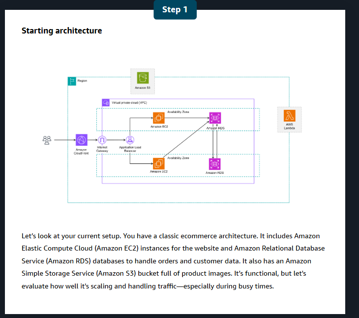
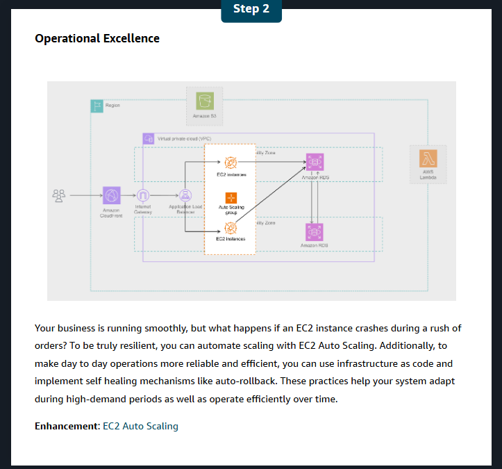
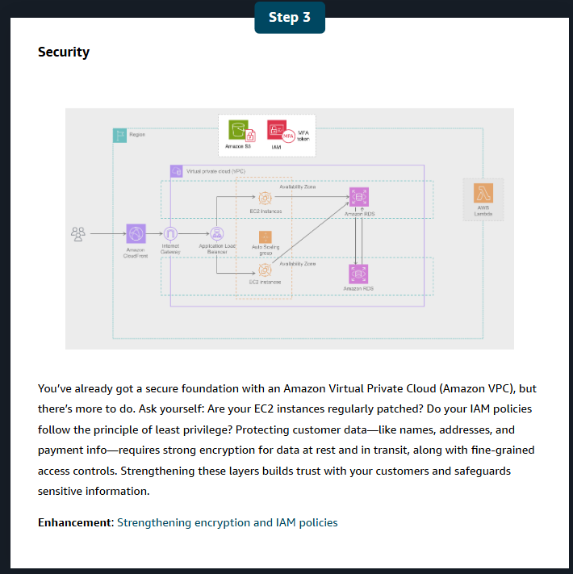
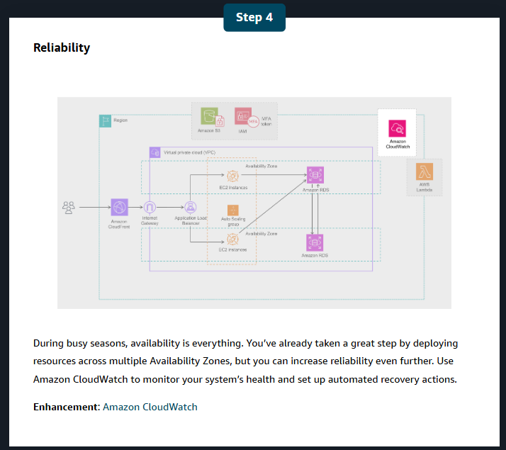
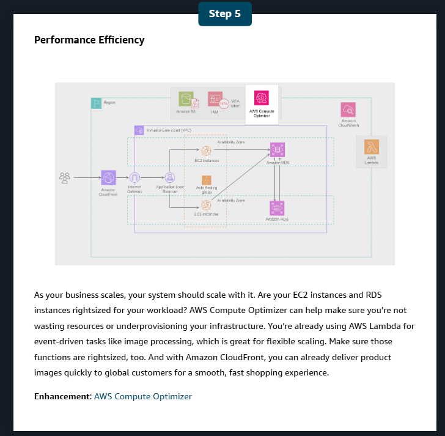
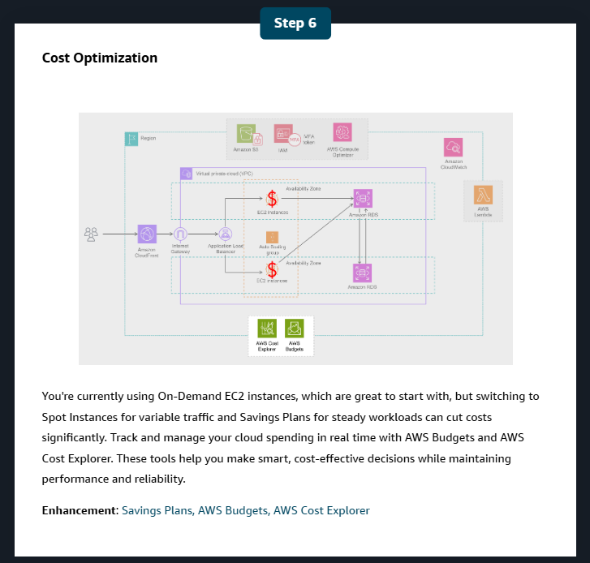
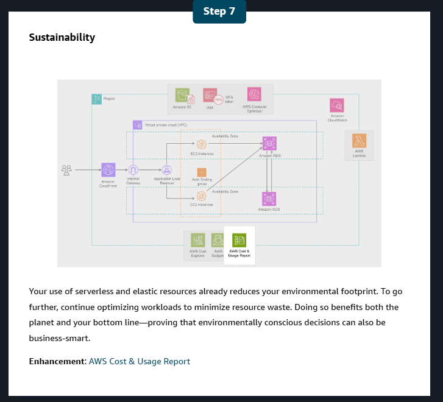
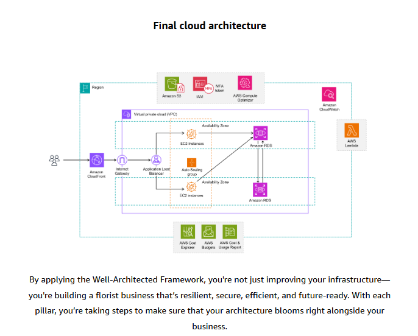

# Module 12: Well-Architected Solutions

> Diagrams live in `well-architected-images/` — keep that folder next to this file.

## Table of contents

1. [AWS specialized services — the four types](#1-aws-specialized-services--the-four-types)
2. [Development services](#2-development-services)
3. [Worked examples: using the development services](#3-worked-examples--using-the-development-services)
4. [Business application services](#4-business-application-services)
5. [End-user computing services](#5-end-user-computing-services)
6. [IoT services](#6-iot-services)
7. [The Well-Architected Framework: six pillars](#7-the-well-architected-framework--six-pillars)
8. [AWS Well-Architected Tool](#8-aws-well-architected-tool)
9. [Optimizing a cloud architecture — the florist walkthrough](#9-optimizing-a-cloud-architecture--the-florist-walkthrough)
10. [Quick recap + exam traps](#10-quick-recap--common-exam-traps)

---

## 1. AWS specialized services — the four types

**AWS services are purpose-built for specific use cases.** Four categories of specialized
service:

| Type | For | Services |
|---|---|---|
| **Development services** | Automating CI/CD pipelines, monitoring and debugging applications, building GraphQL APIs, deploying web and mobile applications | **CodeBuild · CodePipeline · X-Ray · AppSync · Amplify** |
| **Business application services** | Business needs such as **customer service operations** and **email promotions** | **Amazon Connect · Amazon SES** |
| **End-user computing services** | **Remote access** to resources like **virtual desktops and applications** | **AppStream 2.0 · WorkSpaces · WorkSpaces Secure Browser** |
| **IoT services** | Connecting and managing **physical devices** | **AWS IoT Core** |

💡 **"Purpose-built" is the theme of the whole module.** The same idea as the purpose-built
databases in module 6: rather than one general tool bent to every job, AWS ships a service
shaped for each specific problem. Which is also why there are so many services to learn.

---

## 2. Development services

AWS offers several services to help developers **automate CI/CD pipelines, monitor and debug
applications, build GraphQL APIs, and deploy web and mobile applications**.

| Service | What it does |
|---|---|
| **AWS CodeBuild** | A **fully managed continuous integration service** that **compiles source code, runs tests, and produces software packages for deployment**. It **automatically scales to meet demand**, and you **pay only for the build time you use** |
| **AWS CodePipeline** | A **fully managed CI/CD service** that **automates the build, test, and deploy phases** of your release process, so developers **streamline release workflows and reliably deliver new features and fixes without provisioning servers** |
| **AWS X-Ray** | A **tracing, debugging, and performance analysis** tool that helps developers **visualize application behavior** — quickly **identify performance bottlenecks, troubleshoot issues, and optimize applications** for better efficiency and reliability |
| **AWS AppSync** | A **fully managed GraphQL service.** Create a **single GraphQL API** that can **securely access, manipulate, and combine data from multiple data sources**, connecting **frontend applications with backend data** |
| **AWS Amplify** | Streamlines **developing, deploying, and managing secure and scalable full-stack applications**. Quickly add features like **authentication, APIs, storage, and hosting** with **minimal infrastructure management** |

**Definitions from the course:**

- **CI/CD pipelines** automate the **integration, testing, and deployment of code changes**
  to provide **quick and reliable software delivery**.
- **GraphQL** is a **query language for APIs** where **clients request only the specific data
  they need**.
- **Full-stack applications** are software systems involving both **frontend (user
  interface)** and **backend (server-side)** development.

### 📌 CodeBuild vs. CodePipeline

The pair people mix up. **CodeBuild is one step; CodePipeline is the conveyor belt that
runs the steps in order.**

```
   CODEPIPELINE  ───────────────────── the whole release process ──────────────────►
   ┌──────────┐   ┌──────────────┐   ┌──────────────┐   ┌──────────┐   ┌──────────┐
   │  Source  │──►│ Build        │──►│ Test         │──►│ Approve  │──►│ Deploy   │
   │ (Git)    │   │ ← CODEBUILD  │   │ ← CodeBuild  │   │ (manual) │   │          │
   └──────────┘   └──────────────┘   └──────────────┘   └──────────┘   └──────────┘
```

**CodeBuild does the compiling and testing. CodePipeline orchestrates everything from commit
to production.** You can use CodeBuild alone; CodePipeline is what makes it a pipeline.

### 🧒 ELI5 — the school bake sale

- **CodeBuild** is the **oven**. You put the raw ingredients in, and it bakes one cake. It
  also **tastes it to check it isn't awful** (that's the tests). You only pay for the minutes
  the oven is on.
- **CodePipeline** is the **whole production line**: fetch the ingredients, bake, taste,
  get the teacher's approval, then put it on the stall. Every time someone writes a new
  recipe, the line runs by itself.
- **X-Ray** is the **stopwatch on every single step**, so when the cakes come out late you
  know it was the icing that took 40 minutes, not the baking.
- **AppSync** is the **one waiter** who knows which kitchen every dish comes from, so the
  customer orders once instead of visiting four counters.
- **Amplify** is the **pop-up stall kit** — table, sign, till, card reader — that lets one
  person run the whole sale without building anything.

---

## 3. Worked examples — using the development services

> *Your note: `<Provide examples about using some of this services like x-ray>`*

### 🏢 AWS X-Ray — "the checkout is slow and nobody knows why"

**The problem.** Customers complain that checkout takes about **6 seconds**. The application
is made of several microservices, so the engineers each check their own logs — and **every
service looks fine in isolation**. Nobody can point at the culprit, because no single log
shows the *whole* request.

**What X-Ray does.** It **traces one request end to end across every service it touches**,
and draws the result as a timeline and a service map:

```
   ONE CHECKOUT REQUEST — total 6,040 ms

   API Gateway            ▓ 12 ms
   └─ Lambda: checkout    ▓▓▓▓▓▓▓▓▓▓▓▓▓▓▓▓▓▓▓▓▓▓▓▓▓▓▓▓▓▓▓▓▓▓▓▓▓  6,020 ms
      ├─ DynamoDB: getCart      ▓ 18 ms                          ✓ fine
      ├─ RDS: getCustomer       ▓▓ 40 ms                         ✓ fine
      ├─ HTTP: tax-service      ▓▓▓▓▓▓▓▓▓▓▓▓▓▓▓▓▓▓▓▓▓ 4,900 ms   ← ★ THE PROBLEM
      │     └─ retry ×3 (timeout at 1,500 ms each)
      ├─ HTTP: payment-gateway  ▓▓▓▓ 900 ms                      ✓ acceptable
      └─ SNS: orderPlaced       ▓ 8 ms                           ✓ fine
```

**The finding:** the third-party **tax service** is timing out and being **retried three
times**. It isn't even AWS's service, and no AWS metric would have shown it — **CloudWatch
would only have said "Lambda duration is 6 seconds"**, which everyone already knew.

**The fix:** cache tax rates for identical basket totals, cut the timeout from 1,500 ms to
400 ms, and fail soft to a default rate. Checkout drops to **~1.1 seconds**.

**📌 The distinction worth learning:** **CloudWatch tells you a component is slow. X-Ray
tells you *which part of the request* is slow, and what it was waiting on.** Monitoring vs.
tracing.

🛡️ **In practice:** a trace is a causal chain across services for a single transaction —
the same shape as pivoting through an investigation timeline. And the "everything looks fine
in my own logs" problem is exactly why correlation across sources exists.

### 🏢 CodePipeline + CodeBuild — "the Friday deploy"

**Before:** deploying means a developer running a build on their laptop, copying files to a
server over SFTP, and hoping. It takes 40 minutes, only two people know how, and nobody
deploys on a Friday because rollback is manual and terrifying.

**After:**

```
   git push  ──►  CODEPIPELINE fires automatically
                  │
                  ├─ 1. SOURCE   pull the commit
                  ├─ 2. BUILD    CodeBuild: compile + unit tests
                  │              ✗ tests fail → pipeline stops, nothing ships
                  ├─ 3. STAGING  deploy to staging, run integration tests
                  ├─ 4. APPROVE  a human clicks Approve (optional gate)
                  └─ 5. DEPLOY   roll out to production
                                 ✗ health checks fail → AUTO-ROLLBACK
```

**What changed:** deployment is **8 minutes**, anyone can trigger it, broken code **cannot
reach production** because the tests gate it, and a bad deploy rolls itself back. CodeBuild
only bills for the minutes it actually compiles.

💡 **This is the "infrastructure as code and self-healing mechanisms like auto-rollback"
line** from the Operational Excellence pillar in §9, made concrete.

### 🏢 AppSync — "the mobile app makes eleven calls to draw one screen"

A retail mobile app's product page needs: product details (DynamoDB), live stock (an internal
API), reviews (Aurora), and recommendations (a Lambda function). The app makes **four
separate requests**, gets **far more data than it needs** each time, and the screen takes
**2 seconds** to populate on mobile data.

**With AppSync**, the app sends **one GraphQL query** asking for exactly the fields the screen
displays:

```graphql
query {
  product(id: "SKU-4471") {
    name  price  imageUrl          # from DynamoDB
    stock { available }            # from the internal API
    reviews(limit: 3) { stars text }   # from Aurora
    recommendations(limit: 4) { name imageUrl }   # from Lambda
  }
}
```

AppSync fans out to all four sources, assembles one response containing **only those
fields**, and returns it. One round trip, a fraction of the payload — which matters most on
exactly the slow mobile connections where it hurts.

### 🏢 Amplify — "two developers and no ops team"

A startup builds a customer portal. They need **hosting, user sign-up and login, a backend
API, file storage, and CI/CD from Git**. Building that properly means Cognito, API Gateway,
Lambda, S3, CloudFront, and a pipeline — weeks of work before writing a single feature.

**Amplify provides all of it as a managed stack.** Connect the Git repo and every push builds
and deploys the frontend; add authentication and storage as configured features. The team
ships the actual product in days and manages **no infrastructure at all**.

💡 **The trade-off is the usual one:** Amplify makes many architectural decisions for you.
That's a gift at two developers and a constraint at two hundred.

---

## 4. Business application services

Ideal for **managing business application needs such as customer service operations and email
promotions**.

| Service | What it does |
|---|---|
| **Amazon Connect** | An **AI-powered contact center service** to efficiently **set up and operate a scalable customer service call center**. Provides **call routing, recording, and analytics**, integrating seamlessly with other AWS services |
| **Amazon Simple Email Service (SES)** | A **scalable and cost-effective email service provider** that integrates into any application for **reliable, high-volume email automation**. Optimizes delivery of **transactional and marketing emails**, enhancing customer engagement |

**🏢 Amazon Connect example:** a retailer's call center runs on hardware that took nine
months to install and can't handle Black Friday. With Connect, they spin up a cloud contact
center in days: calls route by customer tier, every call is recorded and transcribed
(**Transcribe**, module 7), and sentiment is scored (**Comprehend**). Capacity for Black
Friday is a configuration change, not a procurement project.

**🏢 Amazon SES example:** the same retailer sends order confirmations (**transactional**) and
a weekly newsletter (**marketing**). SES handles both at high volume, manages bounces and
complaints, and — importantly — maintains the **sender reputation** that decides whether mail
lands in the inbox or spam.

🛡️ **Worth knowing from a security angle:** SES is why **legitimate bulk mail from
`amazonses.com` infrastructure** is common, and also why attackers occasionally abuse it.
Sender reputation, SPF/DKIM alignment, and the shared-infrastructure problem are all live
concerns here — the same signals that show up in phishing triage.

---

## 5. End-user computing services

IT departments often need to provide **remote access to resources like virtual desktops and
applications**.

| Service | What it does |
|---|---|
| **Amazon AppStream 2.0** | A **fully managed service that streams applications from the cloud directly to any compatible device** — including **SaaS applications** and applications **converted from desktop to SaaS without code revisions**. Gives **instant access to powerful software without high-end local hardware** |
| **Amazon WorkSpaces** | A **fully managed cloud-based desktop computing service.** Employees **securely access their work environment from any device with an internet connection**, performing the same tasks as on a physical office computer, while companies get **cost-efficiency and easy administration** |
| **Amazon WorkSpaces Secure Browser** *(formerly WorkSpaces Web)* | A **fully managed remote enterprise browser** providing a **protected environment** to access **private websites, SaaS applications, and the public internet**. IT **doesn't need to manage specialized client software, infrastructure, or VPN connections** |

*In **SaaS**, applications are hosted on the cloud and accessed through the internet, without
local installation or maintenance.*

### 📌 AppStream vs. WorkSpaces — one app vs. a whole desktop

| | **AppStream 2.0** | **Amazon WorkSpaces** |
|---|---|---|
| Streams | **One application** | **An entire desktop** |
| User sees | Just the app, on their own device | A full Windows/Linux desktop |
| Typical use | A CAD or analysis tool too heavy for a laptop; giving contractors one tool | Full remote desktops for employees, call centers, offshore teams |

**🧒 ELI5:** **AppStream** is **borrowing one tool** — someone else's very powerful drill,
operated by remote control from your kitchen. **WorkSpaces** is **borrowing the whole
workshop** — every tool, your own bench, exactly as you left it yesterday.
**WorkSpaces Secure Browser** is **a sealed glass box you browse the internet inside**:
whatever you touch stays in the box, and the box is thrown away afterwards.

🛡️ **WorkSpaces Secure Browser is a genuinely useful security control.** Risky browsing —
investigating a suspicious URL, opening an untrusted document, letting a third party into an
internal web app — happens in a disposable remote browser rather than on the endpoint.
Nothing reaches the corporate device, and there's no VPN or client software to manage. It's
the managed version of the detonation VM.

---

## 6. IoT services

> **Internet of Things (IoT)** is a **network of connected physical devices embedded with
> sensors and software that collect and exchange data over the internet.** They can be
> **monitored and controlled remotely** to improve efficiency, provide new services, and
> enhance quality of life.

### AWS IoT Core

A **managed cloud service used to securely connect physical devices with cloud
applications.** It helps create efficient IoT solutions by **streamlining the complex process
of ingesting, processing, and acting on device data**. Device connections and data are
secured with **mutual authentication and end-to-end encryption**, and you can **choose from
several communication protocols**.

**Example IoT solutions:**

- **Smart security cameras** — home monitoring that sends alerts to your phone
- **Smart pet feeders** — a pet feeder you can control remotely
- **Smart irrigation systems** — a rain machine that adjusts watering based on weather and
  soil conditions

💡 **"Mutual authentication" is the detail to notice.** Not just *the device proves who it is
to the cloud*, but *the cloud proves who it is to the device* — both directions. With
millions of cheap devices in physically uncontrolled places, one-way trust isn't enough.

**🧒 ELI5:** IoT Core is the **switchboard for all your gadgets**. The doorbell, the pet
feeder, and the garden sprinkler all speak slightly different languages and none of them
knows how to talk to your phone. The switchboard **checks each gadget really is who it says**,
translates what it says, and passes the message along — for a million gadgets at once.

---

## 7. The Well-Architected Framework — six pillars

| Pillar | What it focuses on |
|---|---|
| **Operational Excellence** | **Operations, monitoring, automation, and continuous improvement** |
| **Security** | **Protects systems and data** through best practices like **least privilege** and **data integrity** |
| **Reliability** | **Recovery planning** and **system adaptability** to meet changing demands |
| **Performance Efficiency** | **Using the right resources for the job** and **adjusting as needs evolve** |
| **Cost Optimization** | **Controlling and reducing costs** through **smart provisioning and resource management** |
| **Sustainability** | **Energy-efficient design** and **environmentally conscious resource usage** |

### The question each pillar asks

```
   OPERATIONAL EXCELLENCE   "Can we run, monitor, and improve this smoothly?"
   SECURITY                 "Is it protected, and can we prove it?"
   RELIABILITY              "Does it survive failure and recover?"
   PERFORMANCE EFFICIENCY   "Are we using the RIGHT resources, sized correctly?"
   COST OPTIMIZATION        "Are we paying more than we need to?"
   SUSTAINABILITY           "Are we wasting energy and resources?"
```

**📌 Two of these pull against each other, deliberately.** More reliability usually costs
more; cheaper usually means less redundancy. **The framework doesn't tell you the answer — it
makes you make the trade-off consciously** instead of discovering it during an outage or on
the invoice.

💡 **Sustainability is the newest pillar** (added 2021), which is why older study material
lists only five. If a question says "five pillars," it's dated — **there are six**.

💡 **Cost Optimization and Performance Efficiency overlap but differ:** performance
efficiency is *"right resource for the job"* (a `t4g.nano` where it fits, Graviton over x86);
cost optimization is *"don't pay more than needed for it"* (Spot, Savings Plans, deleting
what's idle). Right-sizing genuinely serves both — which is why it appears in both pillars.

### 🧒 ELI5 — the six questions about a bicycle

You've built a bike. Six people inspect it:

- **Operational Excellence** — *"Can you fix it easily? Do you notice when the tyres are
  soft?"*
- **Security** — *"Is there a lock, and does only you have the key?"*
- **Reliability** — *"If the chain snaps miles from home, what happens?"*
- **Performance Efficiency** — *"Is this the right bike for the journey? You're riding a
  mountain bike on a motorway."*
- **Cost Optimization** — *"You're paying to store three bikes and you ride one."*
- **Sustainability** — *"Could you use less material and still get there?"*

Every one of them is right, and **none can be fully satisfied at once**. That's the job:
knowing which you're trading away.

---

## 8. AWS Well-Architected Tool

**The AWS Well-Architected Tool (AWS WA Tool) is a free service that helps assess and improve
cloud workloads based on the six key pillars.**

| Feature | What it gives you |
|---|---|
| **Workload reviews** | Structured assessment of a workload against the pillars |
| **Milestone tracking** | Save a point-in-time snapshot and **track improvement over time** |
| **Custom lenses** | **Tailored evaluations** for your own standards or a specific technology |
| **Integration** | Works with AWS services like **IAM** and **APIs**, supporting **team collaboration and continuous progress tracking** |

**Who it's for:** **architects, engineers, and compliance teams.** It promotes **consistent,
actionable, and well-documented architecture reviews.**

💡 **How this connects to module 9:** **Trusted Advisor** runs automated best-practice checks
*continuously*; the **WA Tool** is a *structured review you sit down and do*, answering
questions about a workload. Automated checks catch the mechanical problems; the review catches
the design ones — *"what happens if this Region fails?"* is not something a checker can infer.

**🧒 ELI5:** the WA Tool is the **checklist the bike inspector works through**, question by
question, writing down the answers. **Milestones** mean you keep last year's sheet, so you can
see what you actually fixed. And it's **free** — you pay nothing to be told what's wrong.

---

## 9. Optimizing a cloud architecture — the florist walkthrough

> *Your note: `<Add pictures 1-8>`*

You own a **bustling online florist business**, with orders flooding in at peak times like
**Valentine's Day and Mother's Day**. The architecture needs to be as resilient and efficient
as the operations. Each step applies one pillar.

### Step 1 — Starting architecture



> *"Let's look at your current setup. You have a classic ecommerce architecture. It includes
> **Amazon EC2** instances for the website and **Amazon RDS** databases to handle orders and
> customer data. It also has an **Amazon S3** bucket full of product images. It's functional,
> but let's evaluate how well it's scaling and handling traffic — especially during busy
> times."*

**What's already there:** CloudFront at the edge → internet gateway → **Application Load
Balancer** → **EC2 instances across two Availability Zones** → **RDS** in each AZ, plus **S3**
for images and **Lambda** for event-driven work.

**📌 Note it's not a bad architecture.** It's multi-AZ and load balanced already. The
walkthrough is about **improving a reasonable design**, which is the realistic case — you'll
far more often review something that works than something broken.

### Step 2 — Operational Excellence



> *"Your business is running smoothly, but what happens if an **EC2 instance crashes during a
> rush of orders**? To be truly resilient, you can **automate scaling with EC2 Auto Scaling**.
> Additionally, to make day-to-day operations more reliable and efficient, you can use
> **infrastructure as code** and implement **self-healing mechanisms like auto-rollback**.
> These practices help your system adapt during high-demand periods as well as operate
> efficiently over time."*

**Enhancement: EC2 Auto Scaling.**

💡 Three operational practices in one step: **automated scaling** (capacity follows demand),
**infrastructure as code** (CloudFormation — the environment is rebuildable and reviewable),
and **auto-rollback** (a bad deploy undoes itself).

### Step 3 — Security



> *"You've already got a secure foundation with an **Amazon VPC**, but there's more to do. Ask
> yourself: **Are your EC2 instances regularly patched? Do your IAM policies follow the
> principle of least privilege?** Protecting customer data — like names, addresses, and
> payment info — requires **strong encryption for data at rest and in transit**, along with
> **fine-grained access controls**. Strengthening these layers builds trust with your
> customers and safeguards sensitive information."*

**Enhancement: strengthening encryption and IAM policies.**

💡 Everything from module 8 shows up here: **patching** (your responsibility on EC2 under the
Shared Responsibility Model), **least privilege**, **encryption at rest and in transit**, and
**MFA** — the token icon appearing next to IAM in the diagram.

### Step 4 — Reliability



> *"During busy seasons, **availability is everything**. You've already taken a great step by
> **deploying resources across multiple Availability Zones**, but you can increase reliability
> even further. Use **Amazon CloudWatch** to **monitor your system's health** and set up
> **automated recovery actions**."*

**Enhancement: Amazon CloudWatch.**

💡 **"Automated recovery actions"** is the operative phrase — not just alarms that page a
human, but alarms wired to actions that fix the problem. Same mechanism as module 9's
CloudWatch → Auto Scaling loop.

### Step 5 — Performance Efficiency



> *"As your business scales, your system should scale with it. **Are your EC2 instances and
> RDS instances rightsized for your workload?** **AWS Compute Optimizer** can help make sure
> you're **not wasting resources or underprovisioning** your infrastructure. You're already
> using **AWS Lambda** for event-driven tasks like image processing, which is great for
> flexible scaling — make sure those functions are rightsized too. And with **Amazon
> CloudFront**, you can already deliver product images quickly to global customers."*

**Enhancement: AWS Compute Optimizer.**

**📌 New service not mentioned elsewhere in the course: AWS Compute Optimizer** analyzes your
actual utilization metrics and **recommends optimal instance types and sizes** — for EC2, EBS
volumes, Lambda functions, and ECS on Fargate. It's the service that answers *"is this
right-sized?"* with data rather than a guess.

💡 Note the pillar cuts **both ways**: *"not wasting resources **or underprovisioning**."*
Performance efficiency isn't only about spending less — an undersized instance that makes
customers wait is also a failure of this pillar.

### Step 6 — Cost Optimization



> *"You're currently using **On-Demand EC2 instances**, which are great to start with, but
> switching to **Spot Instances for variable traffic** and **Savings Plans for steady
> workloads** can cut costs significantly. **Track and manage your cloud spending in real time
> with AWS Budgets and AWS Cost Explorer.** These tools help you make smart, cost-effective
> decisions **while maintaining performance and reliability**."*

**Enhancement: Savings Plans, AWS Budgets, AWS Cost Explorer.**

💡 This is module 10's cost optimization method applied to one architecture: **steady baseline
→ Savings Plans**, **variable/interruptible → Spot**, and **Budgets + Cost Explorer** to watch
it. Note the closing clause — *"while maintaining performance and reliability"* — the pillars
are explicitly held in tension.

### Step 7 — Sustainability



> *"Your use of **serverless and elastic resources already reduces your environmental
> footprint**. To go further, **continue optimizing workloads to minimize resource waste**.
> Doing so benefits **both the planet and your bottom line** — proving that environmentally
> conscious decisions can also be business-smart."*

**Enhancement: AWS Cost & Usage Report.**

**📌 Why the sustainability enhancement is a *cost* report:** because **wasted compute and
wasted energy are the same waste**. An idle instance burns electricity and money
simultaneously. That's the pillar's central insight — sustainability and cost optimization
mostly point the same direction, which is why the same data serves both.

### Step 8 — Final architecture



> *"By applying the Well-Architected Framework, you're not just improving your infrastructure
> — you're building a florist business that's **resilient, secure, efficient, and
> future-ready**. With each pillar, you're taking steps to make sure that your architecture
> **blooms right alongside your business**."*

### The whole walkthrough in one table

| Step | Pillar | Question asked | Enhancement |
|---|---|---|---|
| **1** | — | *What have we got?* | Starting architecture: EC2 + RDS (multi-AZ), S3, CloudFront, ALB, Lambda |
| **2** | **Operational Excellence** | What if an instance crashes mid-rush? | **EC2 Auto Scaling** (+ IaC, auto-rollback) |
| **3** | **Security** | Are we patched? Least privilege? Encrypted? | **Stronger encryption and IAM policies** |
| **4** | **Reliability** | Can we detect and recover automatically? | **Amazon CloudWatch** |
| **5** | **Performance Efficiency** | Is everything right-sized? | **AWS Compute Optimizer** |
| **6** | **Cost Optimization** | Are we overpaying for compute? | **Savings Plans, Budgets, Cost Explorer** |
| **7** | **Sustainability** | Are we wasting resources? | **AWS Cost & Usage Report** |
| **8** | — | *What have we built?* | Resilient, secure, efficient, future-ready |

💡 **Notice the shape of the exercise:** nothing was thrown away and rebuilt. **Each pillar
added one capability to an architecture that already worked.** That's how Well-Architected
reviews go in reality — incremental improvement against six questions, not a rewrite.

---

## 10. Quick recap + common exam traps

### Recap

- **Four types of specialized service:** **development**, **business application**,
  **end-user computing**, and **IoT**.
- **Development:** **CodeBuild** (compiles, tests, packages — pay per build minute),
  **CodePipeline** (orchestrates build/test/deploy), **X-Ray** (tracing and debugging across
  services), **AppSync** (managed **GraphQL**, one API over many data sources), **Amplify**
  (full-stack apps with auth, APIs, storage, hosting).
- **Business application:** **Amazon Connect** (cloud contact center), **Amazon SES**
  (high-volume transactional and marketing email).
- **End-user computing:** **AppStream 2.0** (streams **one application**), **WorkSpaces**
  (a **full cloud desktop**), **WorkSpaces Secure Browser** (managed remote enterprise
  browser, no VPN or client software).
- **IoT Core:** securely connects **physical devices** to cloud applications, with **mutual
  authentication and end-to-end encryption**.
- **Six Well-Architected pillars:** **Operational Excellence, Security, Reliability,
  Performance Efficiency, Cost Optimization, Sustainability.**
- **AWS Well-Architected Tool:** **free**; workload reviews, **milestone tracking**, and
  **custom lenses**, for architects, engineers, and compliance teams.
- **The florist walkthrough:** one pillar at a time, each adding a capability — Auto Scaling,
  encryption and IAM, CloudWatch, Compute Optimizer, Savings Plans/Budgets/Cost Explorer, and
  the Cost & Usage Report.

### Traps

| Trap | The truth |
|---|---|
| "There are five Well-Architected pillars" | **Six.** **Sustainability** was added in 2021 — older material is out of date |
| "CodeBuild and CodePipeline are the same" | **CodeBuild** compiles and tests (**one stage**). **CodePipeline** orchestrates the **whole release process** |
| "X-Ray is a monitoring service like CloudWatch" | **CloudWatch** says *a component is slow*. **X-Ray traces one request across services** and shows *which part* was slow and what it waited on |
| "AppStream 2.0 and WorkSpaces are the same" | **AppStream streams an application.** **WorkSpaces provides an entire desktop** |
| "WorkSpaces Secure Browser needs a VPN" | The point is the opposite — **no specialized client software, infrastructure, or VPN connections** to manage |
| "AppSync is a REST API service" | It's **GraphQL** — clients **request only the specific data they need**, from **multiple data sources through one API** |
| "The Well-Architected Tool costs money" | **It's free** |
| "Trusted Advisor and the WA Tool are the same" | **Trusted Advisor** = continuous automated **checks**. **WA Tool** = a structured **review** you conduct, with milestones and custom lenses |
| "Performance Efficiency just means making things faster" | It means **the right resources for the job** — over-provisioning fails this pillar as surely as under-provisioning |
| "Sustainability is unrelated to cost" | **Wasted compute is wasted energy and wasted money.** The course's sustainability enhancement is literally a **cost** report |
| "A Well-Architected review means rebuilding the architecture" | The walkthrough **improves a working design incrementally**, one pillar at a time |
