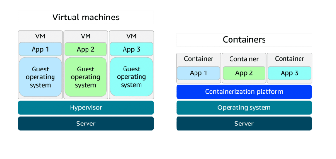
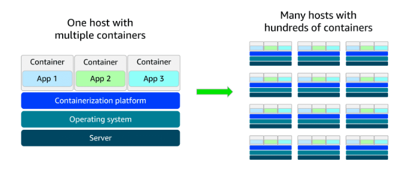

# Module 3: Exploring Compute Services

## Table of contents

1. [Unmanaged vs. Managed vs. Fully Managed](#1-unmanaged-vs-managed-vs-fully-managed)
2. [AWS Lambda (serverless)](#2-aws-lambda--serverless-compute)
3. [Containers and VMs](#3-containers-and-virtual-machines)
4. [Orchestration: why you need it](#4-orchestration--why-hundreds-of-containers-need-a-manager)
5. [AWS container services: ECS, EKS, ECR, Fargate](#5-aws-container-services)
6. [Additional compute: Beanstalk, Batch, Lightsail, Outposts](#6-additional-compute-services)
7. [Choosing the right compute service](#7-choosing-the-right-compute-service)
8. [Quick recap + exam traps](#8-quick-recap--common-exam-traps)

---

## 1. Unmanaged vs. Managed vs. Fully Managed

The single question that separates these: **how much of the stack do you have to babysit?**

| | **Unmanaged** (EC2) | **Managed** (ECS on EC2, Beanstalk, RDS) | **Fully managed / serverless** (Lambda, Fargate) |
|---|---|---|---|
| Physical hardware | AWS | AWS | AWS |
| Hypervisor / virtualization | AWS | AWS | AWS |
| Operating system + patching | **You** | Shared — AWS does a lot, you may still choose instance types, size the fleet, apply some patches | AWS |
| Scaling | **You** (configure Auto Scaling) | Mostly AWS, you set the rules | AWS, automatically |
| Networking config | **You** | Partly you | Mostly AWS |
| Your application code + its security | **You** | **You** | **You** |

**📌 Note the one constant:** *your code and your data are always your responsibility.* Even
on Lambda, AWS secures the platform — you secure what you wrote. That's the **AWS Shared
Responsibility Model** showing up in the compute module.

### 🧒 ELI5 — the pizza analogy

You want pizza for dinner. Four ways to get it:

| How you get pizza | Cloud equivalent | Who does the work |
|---|---|---|
| **Make it from scratch** — grow wheat, build an oven | On-premises data center | You do *everything* |
| **Buy dough + toppings, bake at home** | **Unmanaged — EC2** | AWS gives you the kitchen (the oven, gas, electricity). You still make the pizza and clean up. |
| **Buy a frozen pizza, put it in the oven** | **Managed — ECS / Beanstalk** | Most of the work is already done. You just heat it up and pick when. |
| **Order delivery — it arrives hot and you eat** | **Fully managed / serverless — Lambda** | You do nothing but eat. You don't own an oven, and you only pay when you're actually hungry. |

💡 **The trade-off is always the same:** the less you manage, the less you control.
EC2 lets you install a weird kernel module; Lambda does not. Pick based on how much control
you genuinely need — not on how much control feels safer.

### 🏢 Real example — the same app, three ways

You're running a company website that resizes user-uploaded profile photos.

- **EC2 (unmanaged):** you launch 2 instances, install Linux updates every month, install
  ImageMagick, configure nginx, set up Auto Scaling, and pay 24/7 even at 3 a.m. when
  nobody uploads anything.
- **ECS on Fargate (managed):** you build a container with your resize code, hand it to
  AWS, and AWS runs however many copies are needed. No OS patching.
- **Lambda (fully managed):** you upload just the resize *function*. It runs for 400 ms per
  photo. At 3 a.m. with no uploads, you pay **$0**.

---

## 2. AWS Lambda — serverless compute

**Lambda runs your code in response to an event, and only while it's running.**

- No servers to provision, patch, or scale. (There *are* servers — you just never see them.
  That's what "serverless" really means.)
- Automatic scaling: 1 request or 10,000 concurrent requests, same code, no config change.
- **Billed per millisecond** of execution × the memory you allocated.
- You tune performance with **one main dial: memory size.** More memory = proportionally
  more CPU, so a bigger function often finishes *faster and cheaper*.

### How Lambda works — the four steps

```
  ┌─────────────────────────────────────────────────────────────────────┐
  │  1. UPLOAD          You upload code → it becomes a "Lambda         │
  │                     function" (a .zip, or a container image).      │
  ├─────────────────────────────────────────────────────────────────────┤
  │  2. TRIGGER         You attach an event source:                    │
  │                     S3 upload · API Gateway HTTP request ·         │
  │                     SNS / SQS message · EventBridge schedule ·     │
  │                     DynamoDB change · mobile app · IoT device      │
  ├─────────────────────────────────────────────────────────────────────┤
  │  3. RUN             Event happens → Lambda spins up a runtime,     │
  │                     passes the event data to your function,        │
  │                     runs it, shuts it down. Idle = nothing runs.   │
  ├─────────────────────────────────────────────────────────────────────┤
  │  4. PAY             Charged per millisecond × allocated memory.    │
  │                     No events this month? The bill is $0.          │
  └─────────────────────────────────────────────────────────────────────┘
```

### 🧒 ELI5 — the motion-sensor light

Think about two kinds of light in a hallway.

**The EC2 light** is a normal lamp you switch on in the morning and off at night. It burns
electricity all day — even when nobody walks down the hallway. If a huge crowd comes
through, it's still just one lamp; it can't get brighter on its own.

**The Lambda light** is a motion-sensor light. It sits there doing nothing, costing nothing.
The moment someone walks past (**the event**), it snaps on (**your code runs**), stays on
for exactly the few seconds needed, then switches itself off. If a hundred people walk past
at once, a hundred lights come on — all by themselves. And your electric bill counts only
the seconds the lights were actually on.

That's Lambda: **it wakes up when something happens, does one job, and goes back to
sleep — and you pay only for the awake time.**

### 🧒 ELI5 (version two) — the vending machine vs. the chef

A **chef you hire for the whole day** (EC2) gets paid whether or not anyone orders food.
A **vending machine** (Lambda) sits quietly; you put in a coin (an event), it does exactly
one thing — drops a snack — and then it's quiet again. And if a whole school shows up, it's
as if a hundred vending machines magically appear so nobody waits in line.

### 🏢 Worked example — "the photo that shrinks itself"

Your app lets users upload a profile picture, and you need a small thumbnail version.

**Without Lambda:** you keep a server running 24/7. It sits idle 95% of the time, you patch
its OS monthly, and you pay ~$30/month even in a quiet month.

**With Lambda, step by step:**

1. A user uploads `nikola.jpg` to an S3 bucket named `uploads`.
2. S3 emits an event: *"a new object was created."*
3. That event triggers your Lambda function `makeThumbnail`.
4. Lambda receives the event data (bucket name, file name), downloads the image, resizes
   it to 200×200, and writes `nikola-thumb.jpg` into a `thumbnails` bucket.
5. The function finishes in **380 ms** and shuts down.
6. **Cost:** 380 ms at 512 MB ≈ **$0.0000032** — about three ten-thousandths of a cent.
   10,000 photos a month costs roughly **3 cents**.

Upload nothing for a week? The bill for that week is **zero**.

### Lambda use cases (from the course, with the mechanics filled in)

**1. Real-time image processing — social media app**

- **Trigger:** object created in an S3 bucket.
- **What it does:** resize, apply filters, save in an optimized format (e.g. WebP).
- **Why Lambda:** a celebrity post can cause 50,000 uploads in a minute; Lambda scales to
  match, then back to zero. You never pre-provision for the spike.

**2. Personalized content delivery — news aggregator**

- **Trigger:** an HTTP request through **API Gateway** when a user opens the app or searches.
- **What it does:** fetch articles from multiple sources, run personalization logic against
  the user's preferences, return a ranked list.
- **Why Lambda:** traffic is bursty (everyone checks the news at 8 a.m.), and between
  requests you pay nothing.

**3. Real-time event handling — online game**

- **Trigger:** in-game events — a point scored, an achievement unlocked, a match ended.
- **What it does:** update player data, recalculate the leaderboard, push a notification.
- **Why Lambda:** a weekend tournament can mean thousands of events per second; costs rise
  with play and fall to nearly nothing overnight.

### 💡 Lambda limits you should actually know

| Limit | Value | Why it matters |
|---|---|---|
| Max execution time | **15 minutes** per invocation | Long video renders or multi-hour batch jobs → use **AWS Batch**, ECS, or EC2 instead |
| Memory | 128 MB – 10,240 MB | More memory also buys more CPU |
| Deployment package | 50 MB zipped (250 MB unzipped), or 10 GB as a container image | Big ML models often don't fit a zip |
| Storage during run | 512 MB – 10 GB in `/tmp`, **ephemeral** | Nothing persists between invocations — write to S3/DynamoDB |
| State | **Stateless** | Never assume the next invocation is the same environment |

⚠️ **Cold starts:** the first invocation after idling has to initialize a runtime, adding
tens to hundreds of milliseconds. Usually irrelevant; occasionally it matters for
latency-critical APIs.

---

## 3. Containers and Virtual Machines

A **container** packages your application together with everything it needs to run — code,
libraries, runtime, config — into one portable unit. Same container, same behavior, on your
laptop, in test, and in production.



**Read the diagram bottom-up — the difference is one layer:**

| Layer | Virtual machines | Containers |
|---|---|---|
| Bottom | Server (physical hardware) | Server (physical hardware) |
| Next | **Hypervisor** | **Host operating system** |
| Next | **A full guest OS per VM** ← the heavy part | **Containerization platform** (e.g. Docker) — *one* shared OS |
| Top | App 1, App 2, App 3 — each with its own OS underneath | App 1, App 2, App 3 — sharing the host OS kernel |

Because each VM drags along its own complete operating system, VMs are **bigger** (gigabytes)
and **slower to start** (a full OS boot — tens of seconds to minutes). Containers share the
host OS kernel, so they are **smaller** (megabytes) and start in **milliseconds to seconds**.

| | **Virtual machine** | **Container** |
|---|---|---|
| Isolation boundary | Hypervisor — strong, full OS isolation | OS kernel namespaces — strong, but lighter |
| Guest OS per workload | Yes | No — shares the host OS |
| Typical size | GBs | MBs |
| Startup time | Seconds to minutes | Milliseconds to seconds |
| Density per host | Tens | Hundreds to thousands |
| Can run a different OS than the host? | **Yes** (Windows VM on a Linux host) | **No** — Linux containers need a Linux kernel |
| AWS service | **EC2** | **ECS / EKS / Fargate** |

### 🧒 ELI5 — houses vs. apartments

**Virtual machines are houses.** Each house has its own foundation, its own roof, its own
plumbing, its own furnace. Three families = three complete houses. Very private, but it
takes a long time to build a house, and it uses a lot of land and materials.

**Containers are apartments in one building.** The building already has the foundation, the
roof, and the plumbing (**the shared host operating system**). Each family still gets its own
locked front door and its own rooms — nobody can wander into your apartment — but you didn't
have to build a whole new roof just to move in. Moving into an apartment takes minutes, not
months, and you fit far more families on the same piece of land.

**One catch with the apartment:** everyone shares the building's plumbing. If you need a
*totally different* kind of plumbing — a Windows app in a Linux building — you need your own
house (a VM), not an apartment.

### 🧒 ELI5 — why containers fix "but it works on my machine!"

Imagine you bake a cake at home and it comes out perfect. You bring the recipe to your
friend's house, bake it there — and it's a disaster. Different oven, different flour,
different altitude. You argue: *"but it worked in my kitchen!"*

A container is like **bringing your entire kitchen with you** — your oven, your exact flour,
your exact measuring cups — shrink-wrapped into a box. Wherever you set the box down, the
cake comes out identical, because nothing about the kitchen changed.

### Deployment consistency — the real-world version

When a developer's laptop has Python 3.11 and production has Python 3.8, deployments fail in
confusing ways: it worked in dev, broke in staging, and nobody can reproduce it. Containers
eliminate that whole class of bug by shipping the environment **with** the app. Benefits:

- Dev, staging, and prod are byte-identical → fewer "environment-only" bugs.
- Rollback = run the previous image tag. Fast and reliable.
- Troubleshooting is easier: you can pull the exact production image onto your laptop.
- Portability: the same image runs on AWS, on-premises, or another cloud.

### 💡 Docker vocabulary (you'll be tested on the distinction)

| Term | What it is | Analogy |
|---|---|---|
| **Dockerfile** | A text file of build instructions | The recipe |
| **Image** | The built, immutable, read-only package | The photo/blueprint of the finished meal |
| **Container** | A *running instance* of an image | The actual meal on the plate |
| **Registry** (e.g. **Amazon ECR**) | Where images are stored and versioned | The cookbook library |

An image is to a container what an **AMI** is to an **EC2 instance**: the template versus
the running thing.

---

## 4. Orchestration — why hundreds of containers need a manager



Starting out, you run three containers on one host and manage them by hand — fine. Then the
app grows: **hundreds or thousands of containers spread across many hosts.** Now, by hand,
you'd have to:

- Decide which host has room for each new container (**scheduling / placement**)
- Restart containers that crash (**self-healing**)
- Add or remove containers as traffic changes (**scaling**)
- Route traffic to whichever containers are currently healthy (**service discovery + load balancing**)
- Roll out a new version without downtime, and roll back if it breaks (**deployments**)
- Collect logs and metrics from all of them (**monitoring**)

That is unsustainable manually. **Orchestration tools automate all of it.** On AWS that's
**Amazon ECS** or **Amazon EKS**.

### 🧒 ELI5 — the shipping port

A container ship pulls in carrying thousands of identical metal boxes. Nobody stands on the
dock deciding, box by box, where each one goes — that would take forever and they'd make
mistakes.

Instead the port has a **control tower** (the orchestrator). The control tower knows which
trucks have space, which cranes are free, and where every box needs to end up. If a truck
breaks down, the tower instantly reassigns its boxes to another truck. If twice as many
ships arrive, it calls in more trucks. Nobody has to think about individual boxes.

**You tell the control tower *what* you want** — "I always want 10 copies of my website
running" — **and it figures out *how*.** If a container dies at 3 a.m., the orchestrator
starts a replacement and you keep sleeping.

---

## 5. AWS Container Services

Four services, and people constantly mix them up. Here is the shape of it:

```
             WHAT YOU'RE CHOOSING

  ┌──────────────────────┬──────────────────────────────┐
  │  Where images live   │  Amazon ECR  (the registry)  │
  ├──────────────────────┼──────────────────────────────┤
  │  Who manages the     │  Amazon ECS   (AWS's own)    │
  │  containers          │  Amazon EKS   (Kubernetes)   │
  │  (orchestration)     │                              │
  ├──────────────────────┼──────────────────────────────┤
  │  What they run ON    │  EC2      → you manage the   │
  │  (the launch type /  │             servers          │
  │   compute engine)    │  Fargate  → AWS manages the  │
  │                      │             servers          │
  └──────────────────────┴──────────────────────────────┘

  You pick one from the middle row AND one from the bottom row.
  → 4 valid combinations: ECS+EC2, ECS+Fargate, EKS+EC2, EKS+Fargate
```

### Amazon ECS — Elastic Container Service

AWS's own container **orchestration** service. Runs and manages containers (Docker
containers) on AWS: scheduling, scaling, health, integration with ELB, IAM, and CloudWatch.

- **AWS-proprietary** — simpler to learn, deeply integrated with AWS, no extra control-plane fee.
- The trade-off: it's AWS-specific, so the config doesn't transfer to another cloud.

**Launch types:**

| Launch type | Who it's for | The trade-off |
|---|---|---|
| **ECS on EC2** | Small-to-medium businesses wanting **full control** of the infrastructure; custom apps needing specific hardware, GPUs, or networking | You manage, patch, and pay for the EC2 instances — including idle capacity |
| **ECS on Fargate** | Startups / small teams, web apps with **variable traffic** | **Serverless — no servers to manage.** You pay per container's vCPU + memory. Less low-level control |

**🏢 Real example — ECS on Fargate:** a 4-person startup runs a food-delivery web app.
Traffic triples at lunch and dinner and is nearly zero at 4 a.m. They push their app image
to ECR, define an ECS service ("keep this container running, min 2, max 20"), and choose
Fargate. At noon AWS runs 15 containers; at 4 a.m. it runs 2. Nobody on the team has ever
SSH'd into a server, because there is no server to SSH into.

### Amazon EKS — Elastic Kubernetes Service

A fully managed service for running **Kubernetes** on AWS. Kubernetes is the open-source,
industry-standard orchestrator, and EKS gives you the real thing with AWS running the
control plane, plus community support and upstream updates.

- **Open-source and portable** — your Kubernetes manifests also work on-premises, on Azure
  AKS, or Google GKE. Best defense against lock-in.
- The trade-off: Kubernetes is genuinely complex, and EKS charges an hourly fee for the
  control plane on top of the compute.

**Launch types:**

| Launch type | Who it's for | The trade-off |
|---|---|---|
| **EKS on EC2** | Enterprises needing **full control**; complex, large-scale workloads; deep EC2 customization (GPU nodes, specific instance types) | You manage the worker nodes |
| **EKS on Fargate** | Teams that want Kubernetes flexibility **without managing servers** | Serverless simplicity, but some Kubernetes features (e.g. DaemonSets, privileged containers) aren't supported |

**🏢 Real example — EKS on EC2:** a large bank already runs Kubernetes in its own data center
with 200 microservices and a team of platform engineers. Migrating to AWS, they choose EKS so
their existing YAML manifests and tooling keep working, and EC2 worker nodes so they can use
specific compliance-approved instance types. They keep control; AWS runs the control plane.

### 🧒 ELI5 — ECS vs. EKS

You need someone to run the daycare while you're at work.

- **ECS** is the daycare **run by the same company that owns the building**. Everything just
  works together, the paperwork is short, and it's cheap. But it's *their* system — if you
  ever move to a different building, none of it comes with you.
- **EKS** is a daycare that follows a **worldwide standard method** that every daycare on
  Earth also uses. There's a much thicker rulebook to learn and it costs a bit more, but if
  you move to any other city, your child's routine is identical.

Either way **you** decide who supplies the room:
**you rent and clean the room yourself (EC2)**, or **the room appears when you need it and
disappears when you don't (Fargate)**.

### Amazon ECR — Elastic Container Registry

Where you **store, manage, version, and deploy container images**.

- Supports **Open Container Initiative (OCI)** standard images.
- You `push`, `pull`, and manage images with standard container tooling and CLIs — the same
  `docker push` / `docker pull` you already know.
- Integrates with ECS, EKS, and Lambda container images, plus IAM for access control and
  built-in vulnerability scanning of images.

**🧒 ELI5:** ECR is the **toy box**. You build a toy (an image), put it in the box, and label
it (`v1`, `v2`, `latest`). Later, anyone allowed into the box can take out the exact toy
they need. ECS and EKS are the kids who reach into the box and start playing.

**🏢 Real example:** your CI pipeline builds `myapp:v1.4.2`, pushes it to ECR, and scans it
for known CVEs. ECS then pulls `myapp:v1.4.2` onto 10 tasks. If v1.4.2 misbehaves, you
redeploy `myapp:v1.4.1` — still sitting in ECR — and you're rolled back in a minute.

### AWS Fargate

**A serverless compute engine for containers.** Works with **both** ECS and EKS.

**📌 The distinction the course is making, stated plainly:**

- ECS and EKS are **orchestration services** — they decide *what* runs, *where*, *how many*.
- Fargate is a **container hosting platform / compute engine** — it *provides the capacity*
  the containers actually run on.

So Fargate is not an alternative to ECS or EKS; it's an alternative to **EC2 as the thing
underneath** them. With Fargate you don't provision or manage servers — AWS manages the
infrastructure, and you pay only for the vCPU and memory your containers request, for as
long as they run.

**🧒 ELI5:** ECS/EKS is the **teacher** who tells the kids where to sit and what to do.
Fargate is the **magic classroom that grows and shrinks** — a desk appears the instant a new
kid walks in and vanishes when they leave, and you're only charged for desks that had
someone sitting at them. With EC2 instead, you rent a fixed classroom of 30 desks and pay
for all 30 even when only 4 kids show up.

| | **EC2 launch type** | **Fargate launch type** |
|---|---|---|
| Who patches the OS | **You** | AWS |
| Who sizes the cluster | **You** | AWS (per container) |
| Pay for | The whole instance, idle or not | Only your containers' vCPU + memory |
| Control over host | Full (SSH, GPUs, custom AMIs, daemons) | None — no host access |
| Best for | Steady, high utilization; special hardware; cost tuning at scale | Spiky or unpredictable traffic; small teams; "I don't want servers" |

💡 **Cost intuition:** Fargate costs more *per unit of compute* but you pay for far less of
it. Bursty workload → Fargate usually wins. A cluster pinned at 80% CPU all day → EC2 (with
Savings Plans or Spot) usually wins.

---

## 6. Additional Compute Services

### AWS Elastic Beanstalk

A fully managed service that streamlines **deploying, managing, and scaling web
applications**. You upload your code; Beanstalk automatically provisions the infrastructure
(EC2, ELB, Auto Scaling group) and handles scaling, load balancing, and application health
monitoring. Supports Java, .NET, Python, Node.js, PHP, Ruby, Go, and Docker.

Crucially, it **still gives you full control over the underlying AWS resources** — the EC2
instances are in your account and you can go look at them — while automating the operational
setup. It's a **platform-as-a-service (PaaS)** layer on top of resources you already own.

**Good for:** web applications, RESTful APIs, mobile backends, and microservices, with
automated scaling and simplified infrastructure management.

**🧒 ELI5:** Beanstalk is **furniture delivery with assembly included**. You hand over the
box (your code) and they build the bed, set it in the room, and make it. It's still *your*
bed in *your* room — you can rearrange it later — but you didn't have to read the
instructions or find the little wrench.

**🏢 Real example:** a solo developer has a Django app and a `requirements.txt`. She runs
`eb create`, and in ~5 minutes Beanstalk has launched EC2 instances, put a load balancer in
front, configured an Auto Scaling group, and given her a live URL. She never opened the EC2
console. Six months later she needs a custom nginx setting — and she can, because it's all
standard AWS resources in her account.

💡 **Exam contrast:** *Beanstalk* deploys **your web app onto servers you still own**.
*Lambda* runs **functions with no servers at all**. If the question says "developer just
wants to upload code and have AWS handle deployment of a web app," the answer is usually
**Elastic Beanstalk**.

### AWS Batch

A fully managed service for running **batch computing workloads**. It automatically
schedules, manages, and scales compute resources for batch jobs, sizing and choosing
resources based on each job's requirements — and it can use **Spot Instances** to cut costs
dramatically, because batch jobs tolerate interruption.

**Good for:** large-scale parallel workloads — scientific computing, financial risk
analysis, media transcoding, big data processing, ML training, genomics research.

**🧒 ELI5:** Batch is the **homework pile**. You have 10,000 math problems. You don't need
them answered *this second* — you just need them all done. Batch hires a hundred helpers,
hands each one a stack, waits for them to finish, then sends them all home so you stop
paying. If one helper goes home early, their stack is given to someone else.

**🏢 Real example:** a genomics lab needs to align 5,000 DNA samples. Each sample takes about
2 hours of CPU. They submit 5,000 jobs to Batch; Batch launches ~500 Spot Instances, works
through the queue, retries any job whose Spot instance got reclaimed, and shuts every
instance down when the queue is empty. Total: done overnight, at ~20% of On-Demand cost.

💡 **Why not Lambda?** The 15-minute execution limit. A 2-hour job cannot run on Lambda.
"Long-running, parallel, interruption-tolerant" → **AWS Batch**.

### Amazon Lightsail

Virtual private servers (VPSs), plus storage, databases, and networking, at a **predictable
monthly price** — a fixed bundle rather than per-resource metering. Built for small
businesses, simple workloads, and developers who want a straightforward AWS experience
without the complexity of the full console.

**Good for:** basic web apps, low-traffic websites, dev/test environments, small business
sites, blogs (a one-click WordPress bundle is the classic case), and learning the cloud.

**🧒 ELI5:** Lightsail is the **kids' menu**. The full restaurant menu (all of AWS) has 300
items and you have to build your own meal out of them. The kids' menu has five simple combos,
each at one clear price, and every combo is a complete meal. Less choice — but you order in
10 seconds and you know exactly what you'll pay.

**🏢 Real example:** a dentist's office needs a WordPress site. On plain AWS this means a VPC,
subnets, security groups, an EC2 instance, an EBS volume, an Elastic IP, maybe RDS — and a
bill that varies. On Lightsail they pick the **$5/month WordPress bundle**, get a server,
storage, a static IP, and a data transfer allowance, and the bill is $5 every month. Done in
minutes.

💡 **Exam signal:** "predictable/fixed monthly pricing", "simple", "small business",
"minimal AWS expertise" → **Lightsail**.

### AWS Outposts

A fully managed **hybrid cloud** solution: AWS ships literal AWS-designed racks of compute,
storage, and networking into **your own data center**, and runs them for you. Same AWS APIs,
same services, same tooling as the Region — just physically on your premises.

**Good for:** very low-latency applications, data processing in remote locations, migrating
and modernizing legacy applications that can't move yet, and meeting **regulatory
compliance or data residency** requirements where the data legally must stay in-country or
in-building.

**🧒 ELI5:** Normally you go to the big library downtown (the AWS Region) whenever you need a
book. Outposts is the library **installing a real branch shelf inside your house** — same
books, same checkout system, same librarians maintaining it — but it's in your living room,
so you get your book instantly and nothing ever has to leave the house.

**🏢 Real example:** a car factory has robots on the assembly line that must get a decision
in under 5 milliseconds. A round trip to the nearest AWS Region takes 30 ms — far too slow.
They install an Outposts rack in the factory. The control application runs on EC2 instances
*on that rack*, meeting the latency budget, while aggregated data still syncs to the Region
for analytics. Separately, a hospital in a country whose law forbids patient records leaving
national borders uses Outposts to keep the data physically in-country while using normal AWS
services.

💡 **Exam signal:** "on-premises", "hybrid", "data residency", "single-digit-millisecond
latency to local systems" → **AWS Outposts**.

---

## 7. Choosing the Right Compute Service

### The decision flow

```
 Do you need control of the operating system?
 │
 ├── YES → Special hardware / licensing / legacy app?  → EC2
 │         Must it stay in your own building?           → Outposts
 │         Just want a simple fixed-price server?       → Lightsail
 │
 └── NO  → Is the work short, event-driven, < 15 min?   → Lambda
           │
           ├── Is it a long-running / parallel batch job? → AWS Batch
           │
           ├── Is your app already containerized?
           │     ├── Already invested in Kubernetes?     → EKS
           │     └── Want the simpler AWS-native option?  → ECS
           │           └── ...and for either one:
           │                 don't want servers?          → + Fargate
           │                 need host control?           → + EC2
           │
           └── Just want to upload web app code and go?  → Elastic Beanstalk
```

### One-line cheat sheet

| Service | One-line identity | Kid version |
|---|---|---|
| **EC2** | A virtual server you fully control | Your own house — you fix the roof |
| **Lambda** | Code that runs on an event, then vanishes | Motion-sensor light |
| **ECS** | AWS's container orchestrator | Daycare run by the building's owner |
| **EKS** | Managed Kubernetes | Daycare using the worldwide standard method |
| **Fargate** | Serverless engine *underneath* ECS/EKS | Magic classroom that grows and shrinks |
| **ECR** | Container image storage | The labeled toy box |
| **Elastic Beanstalk** | Upload web app code, AWS builds the stack | Furniture delivered *and* assembled |
| **AWS Batch** | Managed large-scale batch jobs | The homework pile with 100 helpers |
| **Lightsail** | Simple VPS at a fixed monthly price | The kids' menu |
| **Outposts** | AWS hardware in your own data center | A library branch inside your house |

### Management spectrum, drawn out

```
  MORE CONTROL ◄──────────────────────────────────────────► LESS MANAGEMENT
  (more work for you)                                    (more work for AWS)

  Outposts    EC2     Lightsail   ECS/EKS      Beanstalk   ECS/EKS    Lambda
  (your DC)  (raw VM)  (simple    on EC2       (PaaS)      on Fargate (serverless)
                        VPS)
  └─ you patch the OS ─────────────┘           └─ AWS handles the servers ─┘
```

---

## 8. Quick Recap + Common Exam Traps

### Recap

- **Unmanaged → managed → fully managed** is a spectrum of *who patches what*. Your code and
  data are always yours to secure.
- **Lambda** = event-driven, scales automatically, billed per millisecond, **15-minute max**,
  stateless.
- **Containers vs. VMs:** containers share the host OS (small, fast, dense); VMs each carry a
  full guest OS (heavier, slower, but can run a different OS).
- **Containers solve "works on my machine"** by shipping the environment with the app.
- **Orchestration** (ECS / EKS) automates placement, healing, scaling, and rollout once you
  have more containers than you can hand-manage.
- **ECS** = AWS-native and simpler. **EKS** = Kubernetes, portable, more complex.
- **Fargate** is not an orchestrator — it's the serverless *capacity* under ECS or EKS.
- **ECR** stores the images.
- **Beanstalk** = easy web app deployment, you still own the resources.
  **Batch** = big parallel jobs. **Lightsail** = simple fixed-price VPS.
  **Outposts** = AWS in your building.

### Traps

| Trap | The truth |
|---|---|
| "Fargate replaces ECS" | No — Fargate runs *under* ECS or EKS instead of EC2 |
| "Serverless means there are no servers" | There are servers; **you** just don't manage or see them |
| "Lambda can run anything" | **15-minute** cap, stateless, ephemeral storage. Long job → Batch/ECS/EC2 |
| "ECS and EKS both give the same portability" | Only EKS (Kubernetes) is portable off AWS |
| "Beanstalk is serverless" | No — it provisions real EC2 instances in your account |
| "Containers are just lightweight VMs" | Different isolation model; a container can't run a different OS kernel than the host |
| "Lightsail is a different technology" | It's simplified packaging around EC2-style VMs with fixed pricing |
| "Use Lambda for the cheapest compute always" | At steady high volume, EC2 with Savings Plans or Spot is far cheaper |
