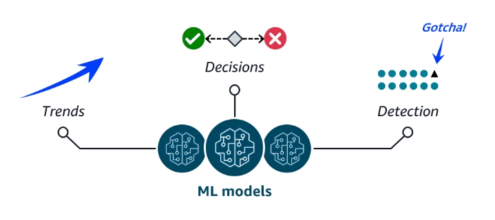
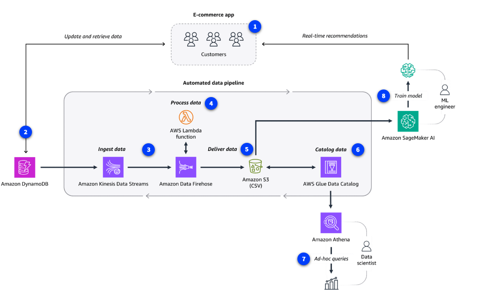

# Module 7: AI & Machine Learning (and Data Analytics)

> Reformatted and expanded study notes.
> **🧒 ELI5** = the "explain it to a kid" version. **🏢 Real example** = a concrete scenario.
> **💡** = added context / exam tip. **📌** = a correction or sharpened definition.
> Diagrams live in `ai-ml-images/` — keep that folder next to this file.
> Companion files: `compute.md`, `Exploring_Compute_Services.md`, `Networking.md`,
> `Storage.md`, `Databases.md`.

---

## Table of contents

1. [AI, ML, deep learning, generative AI — how they nest](#1-ai-ml-deep-learning-generative-ai--how-they-nest)
2. [Common ML business use cases](#2-common-ml-business-use-cases)
3. [The AWS AI/ML stack — three tiers](#3-the-aws-aiml-stack--three-tiers)
4. [Tier 1: Pre-built AI services](#4-tier-1--pre-built-ai-services)
5. [Tier 2: ML services (SageMaker AI)](#5-tier-2--ml-services-sagemaker-ai)
6. [Tier 3: ML frameworks and infrastructure](#6-tier-3--ml-frameworks-and-infrastructure)
7. [Generative AI on AWS](#7-generative-ai-on-aws)
8. [Data analytics: ETL and pipelines](#8-data-analytics--etl-and-pipelines)
9. [AWS data pipeline services](#9-aws-data-pipeline-services)
10. [Choosing the right service](#10-choosing-the-right-service)
11. [Putting it all together — a full pipeline](#11-putting-it-all-together--one-real-architecture)
12. [Quick recap + exam traps](#12-quick-recap--common-exam-traps)

---

## 1. AI, ML, deep learning, generative AI — how they nest

Four terms the course uses across two sections. They are **nested circles**, not competitors:

```
 ┌───────────────────────────────────────────────────────────┐
 │ ARTIFICIAL INTELLIGENCE                                   │
 │ A broad field: intelligent computer systems capable of    │
 │ performing humanlike tasks.                               │
 │                                                           │
 │  ┌──────────────────────────────────────────────────────┐ │
 │  │ MACHINE LEARNING                                     │ │
 │  │ A type of AI. Trains machines to perform complex     │ │
 │  │ tasks WITHOUT EXPLICIT INSTRUCTIONS, by finding      │ │
 │  │ patterns hidden in vast amounts of historical data.  │ │
 │  │                                                      │ │
 │  │  ┌─────────────────────────────────────────────────┐ │ │
 │  │  │ DEEP LEARNING                                   │ │ │
 │  │  │ A subset of ML. Models trained using LAYERS of  │ │ │
 │  │  │ artificial neurons that mimic the human brain.  │ │ │
 │  │  │                                                 │ │ │
 │  │  │   ┌────────────────────────────────────────┐    │ │ │
 │  │  │   │ GENERATIVE AI                          │    │ │ │
 │  │  │   │ Deep learning powered by extremely     │    │ │ │
 │  │  │   │ large models — FOUNDATION MODELS (FMs) │    │ │ │
 │  │  │   │ — pre-trained on vast data and         │    │ │ │
 │  │  │   │ adaptable to MULTIPLE tasks.           │    │ │ │
 │  │  │   └────────────────────────────────────────┘    │ │ │
 │  │  └─────────────────────────────────────────────────┘ │ │
 │  └──────────────────────────────────────────────────────┘ │
 └───────────────────────────────────────────────────────────┘
```

**The two definitions to know verbatim:**

- **AI** — a broad field focused on developing **intelligent computer systems capable of
  performing humanlike tasks**.
- **ML** — a type of AI for **training machines to perform complex tasks without explicit
  instructions**. Training finds **patterns hidden in vast amounts of historical data** to
  produce an **ML model**, which is then applied to **new** data to make **predictions or
  decisions** based on the patterns it learned.

**📌 The single most important contrast in the whole module:**

| | **Traditional ML model** | **Foundation model (generative AI)** |
|---|---|---|
| Trained to | Perform **one single task** | Be **adapted to many tasks** |
| Training data | Your historical data for that task | **Vast** general collections, pre-trained |
| Example | A model that predicts churn, and nothing else | An LLM that summarizes, translates, writes code, and answers questions |

**Large language models (LLMs)** are a popular type of FM **trained to use human language**.
Foundation models can also create **videos, images, music, and more**.

### 🧒 ELI5 — learning by examples, not by rules

Suppose you want to teach a computer to spot a cat in a photo.

**The old way (not ML)** is to write down every rule yourself: *"a cat has pointy ears, and
whiskers, and fur…"* You'd be writing rules forever, and the first photo of a cat from behind
would break all of them.

**Machine learning** is different: you show the computer **a hundred thousand photos**, saying
"cat" or "not a cat" each time — and you never explain what a cat *is*. The computer works out
the pattern by itself. That's what "**without explicit instructions**" means. Afterwards it
can look at a photo it has **never seen before** and tell you.

**Deep learning** stacks that idea in **layers**: the first layer notices edges, the next
notices shapes made of edges, the next notices ears made of shapes, and the last one says
"cat." Each layer summarizes and passes its findings up — exactly how your notes describe it.

**Generative AI** is what you get when the model is so enormous, and has read so much, that
it stops being a one-trick machine. Instead of only saying *whether* something is a cat, it
can **draw you a cat**, write a poem about a cat, and translate that poem into French — none
of which anyone trained it specifically to do.

---

## 2. Common ML business use cases



ML models power the **Amazon.com e-commerce recommendations engine** — but they solve far more
than that. The three shapes in the diagram are the three shapes of almost every ML problem:

| Pattern | What it does | The course's example |
|---|---|---|
| **Predict trends** ↗ | Project what happens next from what happened before | **Future stock prices** |
| **Make decisions** ✅❌ | Route, classify, or choose between options | **Routing callers to the right department** |
| **Detect anomalies** 🎯 | Find the one thing that doesn't fit the pattern | **Bank fraud** |

💡 **Worth noticing for your day job:** that third pattern — *detect the one dot that doesn't
match the other dots* — is exactly what security anomaly detection is. Impossible-travel
logins, a user suddenly touching a hundred file shares, a process spawning something it never
spawns. Same math, different data.

### 🧒 ELI5 — the three questions

Every ML model is really answering one of three questions:

- **"What comes next?"** — you've watched the ice cream van arrive every Tuesday for a year,
  so you can guess it's coming next Tuesday. *(Trends)*
- **"Which box does this go in?"** — someone phones the school; is this a question for the
  nurse, the office, or a teacher? *(Decisions)*
- **"Which one of these is weird?"** — nine teal dots in a row and one black triangle. You
  spot the odd one instantly. *(Detection)*

---

## 3. The AWS AI/ML stack — three tiers


The stack layers by **how much of the work AWS has already done for you** — the same
managed-vs-unmanaged spectrum from `Exploring_Compute_Services.md`, applied to AI.

```
    ╔══════════════════════════════════════════════════════════════╗
    ║ TIER 1 — AI SERVICES                       LEAST WORK FOR YOU║
    ║ Pre-built models, ALREADY TRAINED for specific functions.    ║
    ║ Call an API, get an answer. No ML expertise required.        ║
    ║ → Comprehend, Polly, Transcribe, Translate, Kendra,          ║
    ║   Rekognition, Textract, Lex, Personalize                    ║
    ╠══════════════════════════════════════════════════════════════╣
    ║ TIER 2 — ML SERVICES                                         ║
    ║ A more CUSTOMIZED approach: you build, train, and deploy     ║
    ║ YOUR OWN models — on fully managed infrastructure.           ║
    ║ → Amazon SageMaker AI                                        ║
    ╠══════════════════════════════════════════════════════════════╣
    ║ TIER 3 — ML FRAMEWORKS & INFRASTRUCTURE     MOST CONTROL     ║
    ║ COMPLETELY CUSTOM: your own models, your own frameworks,     ║
    ║ on purpose-built chips and ML-optimized infrastructure.      ║
    ║ → PyTorch / TensorFlow / MXNet on EC2, EMR, ECS              ║
    ╚══════════════════════════════════════════════════════════════╝
```

### 🧒 ELI5 — three ways to get a birthday cake

- **Tier 1 (AI services)** — you **buy a finished cake** from the shop. Somebody else baked
  it, decorated it, and knows exactly how. You just carry it home. Fast and easy; the catch is
  you get the cake they make, not a cake shaped like your dog.
- **Tier 2 (SageMaker AI)** — you **bake it yourself in a professional kitchen** someone else
  owns and cleans. The oven, the mixer, and the worktops are all provided and maintained; you
  bring your own recipe and ingredients. Your cake, none of the plumbing.
- **Tier 3 (frameworks and infrastructure)** — you **build the oven**. You want it a specific
  way because your cake is unlike anyone else's, and you have the expertise to do it. Total
  control, total responsibility.

💡 **This is the same trade-off as EC2 vs. Beanstalk vs. Lambda** in the compute module:
*the less you manage, the less you control.* Most organizations should start at Tier 1 and
only move down when a real requirement forces them to.

---

## 4. Tier 1 — Pre-built AI services

**Ready-to-use, managed services** built from **models that are already trained** to perform
specific functions. They solve a wide variety of business use cases **without you training
anything**. The course groups them into three families.

### 4a. Language services

For when you need to **interpret text or speech and transform it into something meaningful**.

| Service | What it does | Use cases |
|---|---|---|
| **Amazon Comprehend** | Uses **natural language processing** to **extract key insights from documents** — recognizing **key phrases, language, sentiment**, and other common elements | Content classification, **customer sentiment analysis**, compliance monitoring |
| **Amazon Polly** | Converts **text into lifelike speech**. Multiple languages, different genders, a variety of accents | Virtual assistants, e-learning applications, **accessibility for visually impaired users** |
| **Amazon Transcribe** | Converts **speech into text**. Multiple languages, plus **speaker identification, custom vocabulary, and real-time transcription** | Customer call transcription, automated subtitling, metadata generation for media |
| **Amazon Translate** | **Text translation** — **real-time and batch** across multiple languages | Document translation, multi-language application integrations |

**📌 The direction trap — this is on every exam:**

```
        TEXT  ──────── Amazon Polly ────────►  SPEECH     (P = "Play it out loud")
       SPEECH ──────── Amazon Transcribe ───►  TEXT       (T = "Type it out")
        TEXT  ──────── Amazon Translate ─────►  TEXT in another language
        TEXT  ──────── Amazon Comprehend ───►  MEANING (sentiment, entities, topics)
```

**🧒 ELI5 of the four:**

- **Polly** is the **friend who reads the bedtime story out loud** from the book.
- **Transcribe** is the **friend who writes down every word** the teacher says in class.
- **Translate** is the **friend who speaks two languages** and repeats it in the other one.
- **Comprehend** is the **friend who reads the letter and tells you "she sounds angry"** —
  it doesn't change the words, it tells you what they *mean*.

**🏢 Real example of a pipeline:** a call center records support calls. **Transcribe** turns
each recording into text; **Comprehend** reads the text and scores the customer's sentiment;
**Translate** converts the angry ones into the manager's language. Three services, no ML
expertise, no model training.

### 4b. Computer vision and search services

Ideal for **answering questions and gathering insights** from content sources like documents,
images, and videos.

| Service | What it does | Use cases |
|---|---|---|
| **Amazon Kendra** | Uses NLP to **search for answers within large amounts of enterprise content**. Because it **understands the context of a query**, it returns **precise, relevant answers** rather than just a list of keyword-matching documents | **Intelligent search**, chatbots, application search integration |
| **Amazon Rekognition** | Identifies **objects, people, text, scenes, and activities** within **images and videos** stored in **Amazon S3** | **Content moderation**, identity verification, media analysis, home automation |
| **Amazon Textract** | Detects and extracts **typed and handwritten text** from **documents, forms, and even tables** | **Financial, healthcare, and government form** text extraction for quick processing |

**📌 One wording fix:** your notes say "Amazon Rekognition is a **video** analysis service."
It analyzes **both images and videos** — the very next sentence of the courseware says so.
Don't let the exam catch you assuming it's video-only.

**📌 Kendra vs. Rekognition vs. Textract — the one-word difference:**

| Question being asked | Service |
|---|---|
| *"What's **in** this picture or video?"* | **Rekognition** |
| *"What does this **document say** — including the handwriting and tables?"* | **Textract** |
| *"**Where in all our company files** is the answer to this question?"* | **Kendra** |

**🧒 ELI5:**

- **Rekognition** is the friend who **looks at a photo and names everything in it** — "that's
  a dog, that's a car, that's your aunt."
- **Textract** is the friend who **reads a messy form for you**, including the bits scrawled
  in pen, and types it up neatly into boxes.
- **Kendra** is the **librarian who has read every book in the building.** Ask "how many
  holiday days do I get?" and she doesn't hand you 40 books with the word "holiday" in them —
  she tells you **the answer**.

**🏢 Real example of Textract:** an insurance company receives 10,000 handwritten claim forms
a month. Staff used to retype them. Textract extracts the fields — including the handwritten
ones and the table of itemized damages — straight into a database. Days of typing become
minutes.

### 4c. Conversational AI and personalization services

Let users **interact with your apps through text and voice conversations**, and present
**personalized recommendations**.

| Service | What it does | Use cases |
|---|---|---|
| **Amazon Lex** | Adds **voice and text conversational interfaces** to applications, using **natural language understanding (NLU)** and **automatic speech recognition (ASR)** for lifelike conversations | Virtual assistants, natural language search for FAQs, automated application bots |
| **Amazon Personalize** | Uses **historical data** to build applications with **personalized recommendations** for your customers | Personalized streaming, product, and **trending recommendations** |

💡 **Lex is the technology behind Alexa**, which makes it easy to remember: **Lex = you talk
to your app**. And **Personalize = "customers who bought this also bought…"** — the
recommendations engine, offered as a service.

**🧒 ELI5:**

- **Lex** is a **robot receptionist**. You just talk to it normally — "I want to change my
  flight" — and it understands and helps, instead of making you press 1, then 4, then 2.
- **Personalize** is the **shopkeeper who remembers what you like.** You walk in and she
  says "we got new ones of those you bought last time, and people who like those also like
  this." She learned it by watching what everybody buys.

### All nine Tier 1 services at a glance

| Service | One line | Family |
|---|---|---|
| **Comprehend** | Extracts meaning and sentiment from text | Language |
| **Polly** | Text → lifelike speech | Language |
| **Transcribe** | Speech → text | Language |
| **Translate** | Text → another language | Language |
| **Kendra** | Intelligent search over enterprise content | Vision & search |
| **Rekognition** | Identifies things in images and videos | Vision & search |
| **Textract** | Extracts text, forms, and tables from documents | Vision & search |
| **Lex** | Voice and text chatbots (NLU + ASR) | Conversational |
| **Personalize** | Personalized recommendations | Conversational |

---

## 5. Tier 2 — ML services (SageMaker AI)

The **ML services tier** gives customers **more control over their ML solutions without having
to manage infrastructure**. **SageMaker AI** is the key offering.

With this **fully managed service** you **build, train, and deploy your own ML models without
worrying about infrastructure**. The **SageMaker AI IDE** provides **simplified access control
and transparency** over your ML projects: **track model training experiments, visualize data,
and debug and monitor workflows all within one environment**. It also offers **access to
hundreds of pre-trained models** deployable in a few steps.

### Key benefits

| Benefit | What it means |
|---|---|
| **Choice of ML tools** | Increase innovation with different tool choices — **data scientists use the IDE**, **business analysts use the no-code interface** |
| **Fully managed infrastructure** | Focus on **model development** while SageMaker provides **high-performance, cost-effective infrastructure** |
| **Repeatable ML workflows** | Automate and standardize your **MLOps** practices and governance across the enterprise, supporting **transparency and auditability** |

### 🧒 ELI5 — the professional kitchen

Tier 1 was buying a finished cake. **SageMaker is a professional kitchen you can walk into.**

The ovens are already hot, the mixers work, someone else washes up and fixes the dishwasher.
There's even a **shelf of ready-made cake bases** (hundreds of pre-trained models) if you'd
rather not start from flour. But the **recipe is yours**: you decide the ingredients (your
data), you decide how long it bakes (training), and you taste it as you go (tracking
experiments, visualizing, debugging).

And there's a **notebook on the wall recording exactly what you did each time** (repeatable
workflows, MLOps) — so next month you can make the identical cake, and prove to the health
inspector how you made it.

**🏢 Real example:** a logistics company wants to predict which deliveries will be late. No
pre-built AWS service does that — it depends entirely on *their* routes, drivers, and weather
history. In SageMaker AI a data scientist loads three years of delivery data, trains a model,
compares five experiment runs in the IDE, deploys the winner to an endpoint, and monitors it
for drift. AWS provisions and manages every server involved.

---

## 6. Tier 3 — ML frameworks and infrastructure

For organizations with **highly specialized needs requiring complete control over the ML
training process**, using **in-house expertise, ML frameworks, and AWS infrastructure**.

### Core components

| Component | What it is |
|---|---|
| **ML frameworks** | A **software library or tool** providing experienced ML practitioners with **pre-built, optimized components** for building models. AWS supports **PyTorch**, **Apache MXNet**, and **TensorFlow** |
| **AWS ML infrastructure** | **ML-optimized EC2 instances**, **Amazon EMR**, and **Amazon ECS** support these custom solutions, providing **high performance and flexibility** for advanced ML workloads |

**📌 Two notes on that list:**

1. Your notes say "Apache **M-X Net**" — that's the transcription of the spoken name. It's
   written **Apache MXNet**. *(It has since been retired by the Apache Foundation; the course
   still lists it, so learn it as given, but you'll meet PyTorch and TensorFlow in practice.)*
2. The tier definition mentions **purpose-built chips** — those are AWS's own ML silicon:
   **AWS Trainium** (for **training**) and **AWS Inferentia** (for **inference**). You already
   met them in `compute.md` as the **Trn** and **Inf** EC2 instance families. This is where
   that connects.

### 🧒 ELI5 — building your own oven

Some bakers are so specialized that no kitchen on Earth suits them — they need an oven that
runs at a strange temperature for a cake nobody else makes.

So they **build the oven themselves**. AWS still sells them the bricks and the gas line
(EC2 instances, EMR, ECS, and the special chips), but the design is theirs. It takes real
expertise, and things break if you get it wrong — but you can make something nobody else can.

💡 **Exam framing:** Tier 3 is the answer when a question stresses **"complete control,"
"in-house ML expertise,"** or names a **framework** like PyTorch or TensorFlow directly.

---

## 7. Generative AI on AWS

### Key concepts (recap from §1)

- **Deep learning** — a **subset of ML** where models train using **layers of artificial
  neurons that mimic the human brain**. Each layer **summarizes and feeds information to the
  next** until a final model is produced.
- **Generative AI** — a type of deep learning powered by extremely large models called
  **foundation models (FMs)**, **pre-trained on vast collections of data**. Traditional ML
  models are trained for **singular tasks**; **FMs can be adapted to perform multiple tasks**.
- **LLMs** — a popular type of FM **trained to use human language**. FMs can also create
  **videos, images, music, and more**.

### The three generative AI solutions

| Solution | What it is |
|---|---|
| **Amazon SageMaker JumpStart** | An **ML hub with FMs and pre-built ML solutions** deployable **with a few clicks** |
| **Amazon Bedrock** | A **fully managed service** for **adapting and deploying FMs from Amazon and other leading AI companies** |
| **Amazon Q** | An **interactive AI assistant** that can be **integrated with a company's information repositories** |

### Amazon SageMaker JumpStart

A **machine learning hub within SageMaker AI** that **accelerates building, training, and
deploying** models. It offers a **library of pre-built ML solutions** across domains such as
**computer vision, NLP, and tabular data**. These **pre-trained models can be fine-tuned** to
your needs and **deployed with just a few clicks**.

**Common use cases:**

| Use case | What it means |
|---|---|
| **Rapid ML model deployments** | Quickly deploy pre-trained models **without extensive ML expertise** |
| **Custom fine-tuned solutions** | **Fine-tune** pre-trained FMs with your **domain-specific data** |
| **ML experiments and prototypes** | **Compare performance** across different models before committing to an approach |

**🧒 ELI5:** JumpStart is the **shelf of half-finished LEGO models** in the corner of the
kitchen. You don't start from loose bricks — you grab one that's already mostly a spaceship
and change the bits you care about.

### Amazon Bedrock

A **fully managed service specifically designed for working with large foundation models and
building generative AI applications**. It provides **access to FMs from Amazon and leading AI
companies — such as Claude and Stable Diffusion — all through a single unified API**. With
Bedrock you can **quickly experiment with FMs, fine-tune them with your own data, and
seamlessly integrate them into your AWS applications**.

**📌 Naming precision:** the courseware calls Claude and Stable Diffusion "AI startups," but
those are **model names**, not companies — **Claude** is the model family from **Anthropic**,
and **Stable Diffusion** is from **Stability AI**. The point being made is right: Bedrock is a
**marketplace of models from multiple vendors** behind **one API**, so you can switch models
without rewriting your application.

**Common use cases:**

| Use case | What it means |
|---|---|
| **Enterprise-grade generative AI** | Production-ready applications with **enterprise-level security, privacy, and scalability** |
| **Multimodal content generation** | Applications generating **multiple content types**, such as text *and* images |
| **Advanced conversational AI** | Conversational agents that **connect to your enterprise data** for accurate responses |

**🧒 ELI5:** Bedrock is the **universal remote for AI brains.** Lots of companies have built
enormous, very clever brains. Normally you'd need a different remote for each one. Bedrock
gives you **one remote with one set of buttons** that works on all of them — so if you decide
another brain is better at your job, you press the same buttons.

💡 **SageMaker JumpStart vs. Bedrock — the exam contrast:** **JumpStart** is a **hub inside
SageMaker** where you deploy models **onto infrastructure you control**, geared toward
**ML practitioners**. **Bedrock** is a **fully managed, serverless API** for FMs, geared
toward **application developers** who never want to think about infrastructure at all.

### Amazon Q

A **generative AI assistant** that helps companies **streamline processes, get to decisions
faster, and improve employee productivity** — helping every employee **gain insights into
their data and accelerate their tasks**. Two products:

| Product | What it does | Use cases |
|---|---|---|
| **Amazon Q Business** | Answers pressing questions, helps solve problems, and **takes actions** using the data and expertise in **your company's information repositories**, via a **secure connection** to commonly used systems | Information requests, **automated workflows**, insight extraction |
| **Amazon Q Developer** | Provides **code recommendations** for **C#, Java, JavaScript, Python, and TypeScript**. Integrates with **multiple IDEs**, generating **entire functions and logical blocks of code** | Faster code generation, improved reliability and security, **automated code reviews** |

**🧒 ELI5:** Amazon Q is **two different helpers with the same name.**

- **Q Business** is the **colleague who has read every document the company owns** — every
  policy, every wiki page, every past ticket. Ask "what's our refund policy for orders over
  £500?" and you get the answer, not a search results page.
- **Q Developer** is the **helper who sits next to a programmer** and finishes their sentences
  in code.

💡 **Kendra vs. Q Business** — easy to confuse, since both search company content. **Kendra**
is an **intelligent search service** that returns answers; **Q Business** is a **full AI
assistant** that answers, reasons, *and takes actions* across connected systems. Q Business
is the bigger product (and uses Kendra-like retrieval underneath).

---

## 8. Data analytics — ETL and pipelines

> *Your notes' heading reads "Introduction to Data Analystics" — typo for **Analytics**.*

**Both AI/ML and data analytics are supported by good data.** Both need **clean and accessible
data in a format usable by analytics tools and AI algorithms**. That's what **ETL** is for.

### ETL

| Step | What happens |
|---|---|
| **E — Extract** | Pull the data **from various sources** and store it |
| **T — Transform** | Convert it into a **consistent, usable format** for downstream tools |
| **L — Load** | Put it into a **destination system** — a data warehouse or analytics platform |

**Data pipelines** are **automated assembly lines** that make the ETL process **efficient and
repeatable**. AWS has a suite of integrated services for building your own.

### Data analytics

**Data analytics** is when analysts **transform raw historical data to uncover valuable
insights and trends**. Traditional data analysis applies to use cases such as:

- **Loan companies explaining lending decisions** to customers
- **Medical researchers analyzing clinical trial data** through hypothesis testing
- **Insurance companies making risk assessment models transparent** for regulators

💡 **Notice what those three examples have in common: explainability.** Traditional analytics
is chosen precisely *because* a human can trace how the answer was reached — which is exactly
what you need when a regulator or a rejected customer asks "why?" That's the honest reason
analytics hasn't been replaced by ML everywhere.

### 🧒 ELI5 — washing vegetables before cooking

You can't cook with muddy carrots straight from the ground, half of them still in bags, some
in kilograms and some in pounds.

**ETL is the washing and chopping.** **Extract** = bring the vegetables in from the garden,
the shop, and the neighbour. **Transform** = wash off the mud, peel them, cut them all the
same size, agree on one set of units. **Load** = put them neatly in the fridge, ready to cook.

A **data pipeline** is having that whole job **done automatically, every morning, forever** —
so the kitchen always has clean chopped vegetables and nobody has to remember.

---

## 9. AWS data pipeline services

The five stages of a typical AWS data pipeline:

```
  ┌──────────┐   ┌──────────┐   ┌──────────┐   ┌──────────┐   ┌──────────────┐
  │ INGEST   │──►│ STORE    │──►│ CATALOG  │──►│ PROCESS  │──►│ ANALYZE &    │
  │          │   │          │   │          │   │          │   │ VISUALIZE    │
  ├──────────┤   ├──────────┤   ├──────────┤   ├──────────┤   ├──────────────┤
  │ Kinesis  │   │ S3       │   │ AWS Glue │   │ AWS Glue │   │ Athena       │
  │  Data    │   │ (lake)   │   │  Data    │   │  (ETL)   │   │ Redshift     │
  │  Streams │   │          │   │  Catalog │   │          │   │ QuickSight   │
  │ Data     │   │ Redshift │   │          │   │ Amazon   │   │ OpenSearch   │
  │  Firehose│   │ (warehouse)  │          │   │  EMR     │   │  Service     │
  └──────────┘   └──────────┘   └──────────┘   └──────────┘   └──────────────┘
```

### 9a. Data ingestion

**Moving data from source systems into your chosen storage solution.** Use **real-time
ingestion when the data is needed immediately**; use **batch ingestion when some latency is
tolerable**.

| Service | What it does |
|---|---|
| **Amazon Kinesis Data Streams** | **Real-time** ingestion of **terabytes** of data from **applications, streams, and sensors**. **Serverless**, with **automatic provisioning and scaling in on-demand mode** |
| **Amazon Data Firehose** | **Near real-time** ingestion. **Fully managed**, with automatic provisioning and scaling. **Delivers data within seconds** to **data lakes, warehouses, and analytics services** |

💡 **The distinction:** **Kinesis Data Streams** gives you a stream you **build a consumer
for** — custom real-time processing, lowest latency. **Firehose** is **delivery only**: point
it at a destination and it lands the data there, no code. *(Firehose was previously called
Kinesis Data Firehose, which is why older material names it differently.)*

**🧒 ELI5:** **Kinesis Data Streams** is a **conveyor belt** running past you — you stand
there and do something with each item as it goes by, right now. **Firehose** is a **pipe that
just dumps everything into the big bucket** for you. No standing, no doing; it arrives a few
seconds later and that's fine.

### 9b. Data storage

Data comes from many sources and is **commonly consolidated into a single location**. Two
options: **flexible data lakes store vast amounts of raw data**; the **more structured data
warehouses are optimized for business intelligence**.

| Service | What it does |
|---|---|
| **Amazon S3** | A popular choice for **data lakes**. Object storage securely housing **virtually any amount of structured or unstructured data**, **fully elastic**, scaling automatically |
| **Amazon Redshift** | A **fully managed data warehouse** storing **petabytes of structured or semistructured data**, with **scalability and pay-as-you-go pricing** for cost-effective analysis of large datasets |

**📌 Data lake vs. data warehouse — a standard exam distinction:**

| | **Data lake (S3)** | **Data warehouse (Redshift)** |
|---|---|---|
| Holds | **Raw**, any format, structured or unstructured | **Structured/semistructured**, cleaned and modeled |
| Schema applied | **On read** (decide later) | **On write** (decide up front) |
| Best for | Keeping everything cheaply, ML, exploration | **Business intelligence**, fast repeated SQL |
| Cost | Lowest | Higher |

**🧒 ELI5:** a **data lake** is the **giant toy box** — everything goes in, nothing is sorted,
it's cheap and holds anything. A **data warehouse** is the **shelf with labelled bins** —
it took effort to sort, only certain things fit, but you can find anything in a second.

### 9c. Data cataloging

**Cataloging your data with metadata provides an inventory of your organization's data.**

| Service | What it does |
|---|---|
| **AWS Glue Data Catalog** | A **centralized, scalable, managed metadata repository** that **enhances data discovery** and improves pipeline efficiency by **delivering metadata to various data stores and analytics services** |

**🧒 ELI5:** the catalog is the **index card file at the library.** It isn't the books — it's
the record of **what exists, where it is, and what's inside it.** Without it, the toy box is
just a pile and nobody knows what's in there.

### 9d. Data processing

**Clean and transform your data so it's ready to be analyzed.**

| Service | What it does |
|---|---|
| **AWS Glue** | A **fully managed ETL service** making data preparation **simpler, faster, and cost effective**. Glue ETL jobs **use the Glue Data Catalog to access metadata** about sources, informing the transformations in the ETL script |
| **Amazon EMR** | Ideal for **large-scale data processing** and organizations with **existing big data expertise**. Automatically handles **infrastructure provisioning, cluster management, and scaling**. Supports **Apache Spark, Apache Hadoop, and Apache Hive** |

💡 **Glue vs. EMR:** **Glue** is **serverless ETL** — you write the transformation, AWS runs
it, no clusters. **EMR** gives you an actual **managed cluster** running Spark/Hadoop/Hive,
for teams with big data expertise who need that control. *Same pattern as Lambda vs. EC2.*

### 9e. Data analysis and visualization

**Queries and visualization tools help you develop insights about your data.**

| Service | What it does |
|---|---|
| **Amazon Athena** | Run **SQL queries** against data in **relational, nonrelational, object, and custom sources**. **Fully managed and serverless**, accessing data **on S3, on premises, or in multi-cloud environments**. **Pay only for the queries you run** |
| **Amazon Redshift** | The data warehouse again — **columnar storage** and **massively parallel processing** make it ideal for **analyzing large datasets** with **complex SQL** for **frequent, high-performance analytical workloads** |
| **Amazon QuickSight** | **Technical and non-technical users** create **interactive dashboards and reports** from various sources **without managing infrastructure**. **Amazon Q in QuickSight** adds **natural language queries** so users can build and share insights **in seconds** |
| **Amazon OpenSearch Service** | Search content via **precise keyword matching or natural language queries**. **Unified dashboards** give **real-time visualization** as you **analyze and monitor logs, traces, and metrics** |

**📌 Athena vs. Redshift — the most common confusion in this section:**

| | **Amazon Athena** | **Amazon Redshift** |
|---|---|---|
| Model | **Serverless** — nothing to run | A provisioned **warehouse cluster** |
| Data lives | **In place** (S3), queried where it sits | **Loaded into** the warehouse first |
| Pay for | **Each query you run** | The cluster, while it runs |
| Best for | **Occasional / ad-hoc** queries, exploration | **Frequent, high-performance** analytical workloads |

💡 **Redshift appears twice in your notes** (storage *and* analysis) — that's not a mistake in
the courseware. It **is** both: the place the structured data lives, and the engine that
queries it.

**🧒 ELI5 of the four:**

- **Athena** — you **ask a question about the giant toy box without unpacking it.** Pay per
  question.
- **Redshift** — the **sorted shelves**, built for people asking questions all day long.
- **QuickSight** — the **pictures and charts** you put on the wall so everyone can see the
  answer without asking.
- **OpenSearch** — the **search bar for the mountain of logs**, plus live dashboards that
  update as new logs arrive.

💡 **OpenSearch, for your day job:** "analyze and monitor **logs, traces, and metrics**" is
the ELK/SIEM use case. If you've searched logs in a security platform, that's the shape of
OpenSearch.

---

## 10. Choosing the right service

### AI/ML decision flow

```
 What do you need?
 │
 ├── A COMMON task someone has already solved
 │   (read text, hear speech, see images, search docs, chat, recommend)
 │      └──────────────────────────────► TIER 1 AI SERVICE
 │            text → speech ................ Polly
 │            speech → text ................ Transcribe
 │            translate text ............... Translate
 │            meaning / sentiment .......... Comprehend
 │            what's in this image/video ... Rekognition
 │            read a form or document ...... Textract
 │            search company content ....... Kendra
 │            chatbot / voice interface .... Lex
 │            recommendations .............. Personalize
 │
 ├── A model unique to YOUR data and YOUR problem,
 │   but you don't want to manage servers
 │      └──────────────────────────────► TIER 2: SageMaker AI
 │            ...starting from a pre-built model? → SageMaker JumpStart
 │
 ├── GENERATIVE AI in an application
 │      ├── Call foundation models via one managed API ──► Amazon Bedrock
 │      ├── An assistant over company data ─────────────► Amazon Q Business
 │      └── Code assistance in the IDE ─────────────────► Amazon Q Developer
 │
 └── COMPLETE CONTROL: your own frameworks and chips
        └──────────────────────────────► TIER 3: PyTorch / TensorFlow / MXNet
                                          on EC2, EMR, ECS (Trainium/Inferentia)
```

### Analytics pipeline cheat sheet

| Stage | Service | One line | Kid version |
|---|---|---|---|
| Ingest (real-time) | **Kinesis Data Streams** | Terabytes, real time, you build the consumer | The conveyor belt |
| Ingest (near real-time) | **Data Firehose** | Delivers to destinations in seconds, no code | The pipe into the bucket |
| Store (lake) | **Amazon S3** | Any amount of raw data, elastic | The giant toy box |
| Store (warehouse) | **Amazon Redshift** | Petabytes of structured data for BI | The labelled shelves |
| Catalog | **Glue Data Catalog** | Managed metadata repository | The library index cards |
| Process (serverless) | **AWS Glue** | Fully managed ETL | The automatic washing-up |
| Process (clusters) | **Amazon EMR** | Managed Spark / Hadoop / Hive | Your own industrial kitchen |
| Analyze (ad-hoc) | **Amazon Athena** | Serverless SQL, pay per query | Asking about the toy box |
| Analyze (frequent) | **Amazon Redshift** | Columnar + MPP for heavy SQL | The sorted shelves |
| Visualize | **Amazon QuickSight** | Dashboards for everyone, NL queries via Amazon Q | Charts on the wall |
| Search & observe | **OpenSearch Service** | Search plus log/trace/metric dashboards | The search bar for logs |

---

## 11. Putting it all together — one real architecture

Everything in this module in a single diagram: an **e-commerce app with real-time
recommendations**, built on an **automated data pipeline**.



### Follow the numbers

| # | Step | Service | What's happening |
|---|---|---|---|
| **1** | Customers use the app | **E-commerce app** | People browse, click, and buy. Every action is data |
| **2** | Update and retrieve data | **Amazon DynamoDB** | The app's live operational database — carts, profiles, orders. Fast key lookups at any scale *(see `Databases.md`)* |
| **3** | **Ingest** data | **Kinesis Data Streams** | Every event streams off DynamoDB in **real time** |
| **4** | **Process** data | **AWS Lambda** | A function **transforms** each event as it flows past — the **T** in ETL, serverless, no servers to run *(see `Exploring_Compute_Services.md`)* |
| **5** | **Deliver** data | **Amazon Data Firehose → Amazon S3 (CSV)** | Firehose lands the processed records in the **S3 data lake**, within seconds |
| **6** | **Catalog** data | **AWS Glue Data Catalog** | Records the metadata — what's in the lake, where, and what shape it is |
| **7** | **Ad-hoc queries** | **Amazon Athena** | A **data scientist** runs serverless SQL **directly against S3**, using the catalog, and charts the results. Pay per query |
| **8** | **Train model** | **Amazon SageMaker AI** | An **ML engineer** trains a recommendation model on the same S3 data, then deploys it — and it serves **real-time recommendations straight back into the app** |

### Why this diagram is worth memorizing

It shows the **two different consumers of one pipeline**, which is the real insight:

```
                        ┌──────────────────────────────────┐
   Raw events ──► pipeline ──► S3 data lake ──┬─► ATHENA ──► data scientist
                        └───────────────────┘ │   "what happened?"  (analytics)
                                              │
                                              └─► SAGEMAKER ► ML engineer
                                                  "what happens next?"  (ML)
```

**The same clean data feeds both.** The analytics branch **looks backward** and explains;
the ML branch **looks forward** and predicts. That's why the course teaches AI/ML and data
analytics in one module — and why "both AI/ML and data analytics are supported by good data"
is the sentence the whole thing hangs on.

Also notice the **loop closing**: data leaves the app at step 1 and comes **back** to it at
step 8 as recommendations. The app gets smarter from its own exhaust.

### 🧒 ELI5 — the lemonade stand that learns

You run a lemonade stand. **(1)** Kids come and buy lemonade. **(2)** You write every sale in
your notebook right away, so you never forget one.

Now you set up a **machine that copies each sale onto a conveyor belt the moment it
happens (3)**. A little helper stands by the belt **tidying each note (4)** — same date format,
no smudges. Then a **pipe dumps all the tidy notes into a giant box (5)** in the garage.

Because the box is huge, you keep **index cards saying what's in it (6)**.

Two people now use that box. Your **big sister asks questions about the past (7)**: *"how much
did we sell on rainy Tuesdays?"* And your **clever friend uses it to guess the future (8)**:
he reads all the notes, works out that kids who buy lemonade usually also want a cookie — and
now, **the moment a kid buys lemonade, your stand offers them a cookie.**

The stand learned from its own notes. That's the whole picture.

---

## 12. Quick recap + common exam traps

### Recap

- **AI ⊃ ML ⊃ deep learning ⊃ generative AI.** ML learns patterns from **historical data
  without explicit instructions**; deep learning uses **layers of artificial neurons**;
  generative AI runs on **foundation models** that, unlike traditional single-task models, are
  **adaptable to many tasks**.
- **Three ML patterns:** predict **trends**, make **decisions**, detect **anomalies**.
- **The AWS AI/ML stack has three tiers:** pre-built **AI services** → **SageMaker AI** →
  **frameworks and infrastructure**. Less work vs. more control.
- **Nine Tier 1 AI services**, in three families: language (**Comprehend, Polly, Transcribe,
  Translate**), vision and search (**Kendra, Rekognition, Textract**), conversational and
  personalization (**Lex, Personalize**).
- **SageMaker AI** = build, train, deploy **your own** models on managed infrastructure, with
  an IDE, a no-code interface, experiment tracking, and **repeatable MLOps workflows**.
- **Generative AI on AWS:** **SageMaker JumpStart** (hub of FMs and solutions, deploy in
  clicks), **Amazon Bedrock** (FMs from multiple vendors through **one unified API**),
  **Amazon Q** (**Business** for company data, **Developer** for code).
- **ETL** = Extract, Transform, Load. **Data pipelines** automate it.
- **Pipeline stages:** ingest (**Kinesis / Firehose**) → store (**S3 lake / Redshift
  warehouse**) → catalog (**Glue Data Catalog**) → process (**Glue / EMR**) → analyze and
  visualize (**Athena / Redshift / QuickSight / OpenSearch**).

### Traps

| Trap | The truth |
|---|---|
| Polly and Transcribe do the same thing | **Opposite directions.** **Polly**: text → speech. **Transcribe**: speech → text |
| Comprehend translates text | **No** — Comprehend extracts **meaning** (sentiment, key phrases, language). **Translate** changes the language |
| Rekognition is video-only | **Images *and* videos** (stored in S3) |
| Textract is just OCR for typed text | Also **handwritten** text, **forms**, and **tables** |
| Kendra returns a list of matching documents | It **understands query context** and returns **precise answers**, not keyword hits |
| SageMaker is a pre-trained AI service | **Tier 2** — you **build and train your own** models. Pre-trained-and-ready is **Tier 1** |
| Bedrock and SageMaker JumpStart are the same | **Bedrock** = managed **API** to FMs from multiple vendors, for app developers. **JumpStart** = a **hub inside SageMaker** for ML practitioners deploying models on their own infrastructure |
| Claude and Stable Diffusion are companies | They're **models** — Claude from **Anthropic**, Stable Diffusion from **Stability AI**. Bedrock's point is **many vendors, one API** |
| Amazon Q is one product | **Two**: **Q Business** (company data and workflows) and **Q Developer** (code) |
| A data lake and a data warehouse are interchangeable | **Lake (S3)** = raw, any format, schema on read. **Warehouse (Redshift)** = structured, modeled, schema on write |
| Athena and Redshift are interchangeable | **Athena** = serverless, queries data **in place** in S3, **pay per query**, ad-hoc. **Redshift** = a provisioned warehouse for **frequent, high-performance** workloads |
| Glue and EMR are interchangeable | **Glue** = serverless ETL, no clusters. **EMR** = managed **Spark/Hadoop/Hive clusters**, for teams with big data expertise |
| Kinesis Data Streams and Firehose are the same | **Streams** = real-time, **you build the consumer**. **Firehose** = near real-time **delivery** to a destination, no code |
