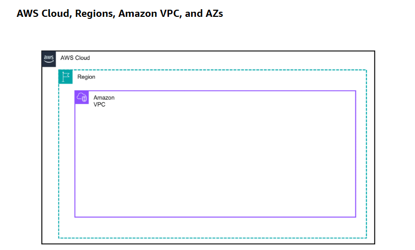
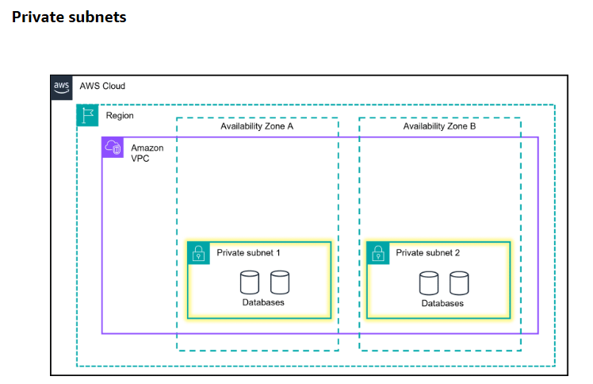
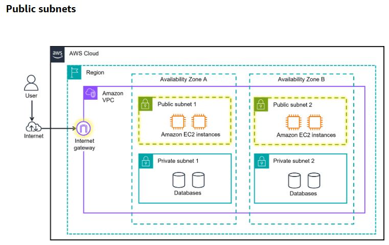
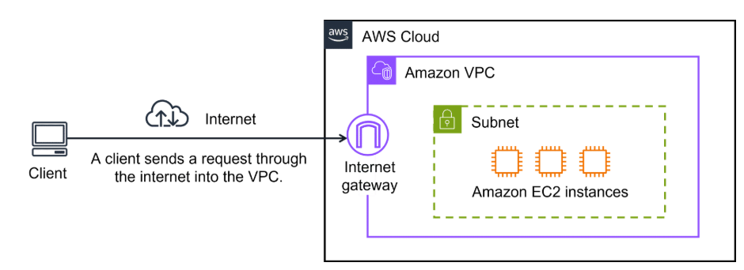
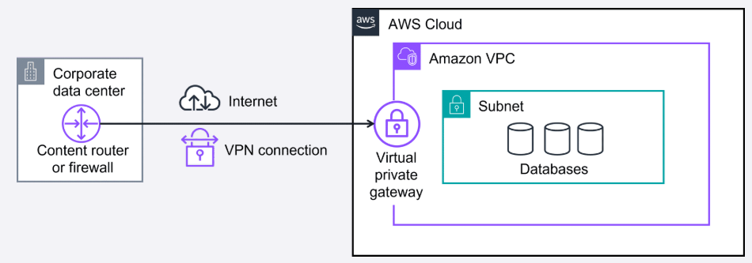

# Module 4: Networking

> Reformatted and expanded study notes.
> **🧒 ELI5** = the "explain it to a kid" version. **🏢 Real example** = a concrete scenario.
> **💡** = added context / exam tip. **📌** = a correction or sharpened definition.
> Companion files: `compute.md`, `Exploring_Compute_Services.md`.
> Diagrams live in `networking-images/` — keep that folder next to this file.

---

## Table of contents

1. [Amazon VPC — your own private slice of AWS](#1-amazon-vpc--your-own-private-slice-of-aws)
2. [Subnets — public and private](#2-subnets--public-and-private)
3. [Gateways: internet gateway vs. virtual private gateway](#3-gateways--getting-traffic-in-and-out)
4. [Connecting to the AWS Cloud (4 options)](#4-connecting-to-the-aws-cloud--the-four-options)
5. [**When to use which connection**](#5-when-to-use-which-connection--the-decision-guide) ← your question
6. [Direct Connect failover example](#6-direct-connect-failover--the-high-bandwidth-example) ← your question
7. [Additional gateway services](#7-additional-gateway-services)
8. [Network traffic in a VPC: packets, NACLs, security groups](#8-network-traffic-in-a-vpc)
9. [Security groups vs. network ACLs](#9-security-groups-vs-network-acls-picture-6-as-a-table)
10. [Edge networking: Route 53, CloudFront, Global Accelerator](#10-edge-networking-services)
11. [Quick recap + exam traps](#11-quick-recap--common-exam-traps)

---

## 1. Amazon VPC — your own private slice of AWS

**Amazon Virtual Private Cloud (VPC)** lets you provision a **logically isolated section of
the AWS Cloud** where you launch AWS resources into a virtual network **you define** — your
own IP address range, subnets, route tables, and gateways.



**Read the boxes from the outside in — this nesting is the mental model for everything else:**

| Box | What it is | Diagram style |
|---|---|---|
| **AWS Cloud** | The outermost box in nearly every AWS diagram — all of AWS | Solid black outline |
| **Region** | A separate **geographic area** (e.g. `us-east-1`, `eu-central-1`) | Dashed teal box |
| **Availability Zone (AZ)** | One or more **discrete data centers** inside a Region, each with redundant power, networking, and connectivity, in **separate physical facilities** | Dashed teal boxes side by side |
| **VPC** | **Your** isolated, logically segmented network inside the Region | Solid purple box |
| **Subnet** | A slice of the VPC — a range of IP addresses inside one AZ | Solid = private, dashed = public |

**How you choose a Region** — four factors:

1. **Latency** — pick one close to your users.
2. **Compliance and data residency** — some data legally must stay in a country.
3. **Service availability** — not every service launches in every Region at once.
4. **Cost** — prices differ per Region.

**Why multiple AZs matter:** spreading resources across AZs protects your application from
the **failure of a single location** within a Region. One AZ losing power doesn't take you
down.

### 🧒 ELI5 — the apartment building

- **AWS Cloud** = the whole city.
- **Region** = one neighborhood in that city. You pick the neighborhood closest to your friends.
- **Availability Zones** = separate apartment buildings in that neighborhood, each with its
  own electricity and water. If one building's power goes out, the other is fine.
- **Your VPC** = your own apartment, with a locked front door. Neighbors can't see inside.
- **Subnets** = the rooms in your apartment. Some rooms have windows to the street (public);
  some are interior rooms with no outside access at all (private).

**📌 Key point people miss:** a VPC belongs to **one Region** but **spans all the AZs** in
it. A **subnet**, on the other hand, lives in exactly **one AZ**. That's why "put it in
multiple AZs" in practice means "create a subnet in each AZ."

### The three benefits of Amazon VPC

| Benefit | What it means |
|---|---|
| **Security** | Secure and monitor connections, screen traffic, restrict instance access |
| **Control** | Full control over resource placement, connectivity, and security |
| **Convenience** | Far less time setting up, managing, and validating a virtual network than on-premises networking |

---

## 2. Subnets — public and private

A **subnet** is a section of a VPC where you group resources based on **security or
operational needs**. A subnet is a **range of IP addresses** within your VPC.

### Private subnets



Private subnets **isolate resources that should not be directly exposed to the internet**.
Classic contents: databases holding customer records, personal data, and transaction history.
**Drawn as solid boxes.**

### Public subnets



Public subnets **provide direct internet access** to the resources inside them, because they
are connected to an **internet gateway**. Classic contents: a customer-facing website, the
web tier of an application. **Drawn as dashed boxes.**

**Subnets can talk to each other.** In a VPC you define rules that let resources in
different subnets communicate — e.g. EC2 instances in a **public** subnet querying databases
in a **private** subnet. That's the standard two-tier web architecture:

```
   Internet
      │
      ▼
 ┌─────────────────┐
 │ Internet gateway│
 └────────┬────────┘
          │
  ┌───────▼────────────────────────────┐   VPC
  │  PUBLIC subnet   (dashed)          │
  │  ┌──────────┐  ┌──────────┐        │
  │  │   EC2    │  │   EC2    │  ← web servers, reachable from the internet
  │  └────┬─────┘  └────┬─────┘        │
  │       │             │              │
  │  ─────┼─────────────┼───────────── │  internal traffic only
  │       ▼             ▼              │
  │  PRIVATE subnet  (solid)           │
  │  ┌──────────┐  ┌──────────┐        │
  │  │ Database │  │ Database │  ← never directly reachable from the internet
  │  └──────────┘  └──────────┘        │
  └────────────────────────────────────┘
```

### 🧒 ELI5 — the shop and the back room

Your building has a **front shop** (public subnet) where customers walk in off the street,
look at the shelves, and buy things. Behind it is a **locked back room** (private subnet)
where you keep the safe with everyone's credit card details.

Customers can *never* walk into the back room. But the **shop assistant** (the EC2 instance
in the public subnet) is allowed to go through the inner door, fetch what's needed, and bring
it out front. The safe stays in the back room the whole time.

---

## 3. Gateways — getting traffic in and out

### Internet gateway (IGW) — the public front door



To allow **public traffic from the internet** to reach your VPC, you attach an **internet
gateway** to the VPC. It is the connection between a VPC and the internet.

Think of it as the **doorway customers use to enter the coffee shop**. **Without an internet
gateway, nobody outside can access the resources in your VPC at all.**

### Virtual private gateway (VGW) — the private side door



What if your VPC holds **only private resources** and you still need to reach them — from
your office, say?

The internet is like the **public road** between your home and the coffee shop: open to
anyone. You want to protect the traffic you send over it from the public, from ISPs, and from
anyone trying to track or intercept it. That's what a **VPN connection** provides — a
**secure tunnel through the internet**, using encryption to hide everything you send and
receive.

The **virtual private gateway** is the component **on the AWS side** that lets this protected
traffic enter the VPC. With it, you establish a VPN connection between your VPC and a private
network — an on-premises data center or internal corporate network. **A virtual private
gateway only allows traffic in if it comes from an approved network.**

### 🧒 ELI5 — two doors and a secret tunnel

Your clubhouse has two ways in.

- The **front door** (internet gateway) opens onto the busy street. Anyone can walk up to it.
  Whether they get in depends on the guards inside — but the door itself is public.
- The **secret tunnel** (VPN through the virtual private gateway) runs underground from your
  own house to a hidden hatch in the clubhouse floor. Nobody walking down the street can see
  you using it, and the hatch only opens for people coming from *your* house.

Remove the front door and no stranger can ever reach the clubhouse. Remove the tunnel and you
have to use the public street like everyone else.

### 📌 The three confusing acronyms, kept straight

| Term | Full name | One-line job |
|---|---|---|
| **VPC** | Amazon Virtual Private Cloud | **Establishes the boundary** around your AWS resources |
| **VGW** | Virtual private gateway | **The door in the VPC** that lets protected traffic enter |
| **VPN** | Virtual private network | **The encrypted tunnel** protecting the traffic in transit |

💡 Easiest way to remember: **VPC = the house. VGW = the door. VPN = the armored tunnel
leading to the door.** The VPN is the *connection*; the VGW is the *attachment point*.

---

## 4. Connecting to the AWS Cloud — the four options

Companies have on-premises data centers, branch offices, factories, and remote workers, so
AWS offers four different ways in:

### 1. AWS Client VPN — for **people**

Connects your **remote workers** (and on-premises networks) to the cloud. It's a **fully
managed, elastic** VPN service that **automatically scales up and down with user demand**.
Because it's a cloud VPN, you don't install or manage hardware, and you don't have to guess
how many simultaneous remote users to size for. It uses an **OpenVPN-based client** and works
across Regions over the AWS global network.

- **Benefits:** advanced authentication, remote access, elastic, fully managed.
- **Use case:** quickly scale remote-worker access.
- **🧒 ELI5:** a **magic key** you install on each person's laptop. Wherever they are —
  hotel, café, home — the key opens a private tunnel straight into the office network. If
  500 new people join tomorrow, you just hand out 500 keys; nobody has to install a machine.
- **🏢 Real example:** a company acquires a 300-person startup with fully remote staff. Day
  one, those employees need access to internal AWS resources. Client VPN issues them
  credentials and scales to however many are connected at once.

### 2. AWS Site-to-Site VPN — for **buildings**

Creates a **secure, encrypted connection between your data center or branch offices and your
AWS resources**, over the public internet.

- **Benefits:** high availability, secure and private sessions, accelerates applications.
- **Use cases:** application migration, secure communication between remote locations.
- **🧒 ELI5:** instead of giving every person a key, you build **one armored tunnel between
  two whole buildings**. Everyone in the office building can walk through it without needing
  their own key, because the *buildings* are connected, not the individuals.
- **🏢 Real example:** a manufacturer has HQ, a factory, and two branch offices. Each site
  gets a Site-to-Site VPN into the VPC, so all four locations reach the same inventory
  application as if it were on the local network.

### 3. AWS PrivateLink — for **services, without ever touching the internet**

A highly available, scalable technology that **privately connects your VPC to services and
resources as if they were inside your VPC**. Critically: you need **no internet gateway, no
NAT device, no public IP address, no Direct Connect, and no Site-to-Site VPN** for your
private subnets to reach those services. Instead you control exactly **which API endpoints,
sites, services, and resources** are reachable from your VPC.

- **Benefits:** secures your traffic, simplified management rules.
- **Use case:** connecting clients in your VPC to resources, other VPCs, and endpoints.
- **🧒 ELI5:** you and your best friend live in different houses but want to share toys.
  Instead of carrying them down the public street where anyone can see, you install a
  **private pipe from your bedroom directly into theirs**. The toys never go outside. And the
  pipe only connects those two rooms — not the whole house.
- **🏢 Real example:** a bank's application in a private subnet needs to call Amazon S3 and a
  SaaS vendor's API. Regulation forbids that traffic traversing the public internet. With
  PrivateLink endpoints, the traffic stays on the AWS private network end to end, and the
  subnet still has **no** route to the internet.

💡 **PrivateLink's real superpower:** it's how you keep a subnet with **zero internet access**
while still using AWS services. It's a favorite exam answer whenever a question says
"without traversing the public internet."

### 4. AWS Direct Connect — for **dedicated bandwidth**

Establishes a **dedicated private connection** between your network and your VPC — a physical
fiber circuit, not a tunnel over the internet. Traffic goes from your corporate data center
to an **AWS Direct Connect location**, then into your VPC through a **virtual private
gateway**. All traffic between your data center and the VPC flows over that dedicated
private connection.

- **Benefits:** reduces network costs, increases available bandwidth, consistent performance.
- **🧒 ELI5:** the VPN options all drive on the **public highway** — encrypted car, but still
  stuck in whatever traffic everyone else creates. Direct Connect is **your own private road**
  built between your building and AWS. No other cars on it. Same travel time every single
  day. It costs real money and takes weeks to build, because someone has to lay the road.

**Three situations where Direct Connect is the answer:**

| Situation | Why Direct Connect |
|---|---|
| **Latency-sensitive applications** | It **bypasses the internet**, giving a consistent, low-latency experience — ideal for video streaming and other real-time applications |
| **Large-scale data migration or transfer** | Smooth, reliable transfers at massive scale: real-time analysis, rapid data backup, broadcast media processing |
| **Hybrid cloud architectures** | Links AWS and on-premises networks so applications can span both environments without compromising performance |

⚠️ **The one thing to remember about Direct Connect:** it is a **private** connection, but it
is **not encrypted by default**. If you need both dedicated bandwidth *and* encryption, you
run a **VPN over the Direct Connect link**.

---

## 5. When to use which connection — the decision guide

> *This answers your note: "I need to know when to use which connection."*

### The one-question-each version

| If the question mentions… | The answer is |
|---|---|
| **Remote workers / individual laptops / work from anywhere / scale up user access** | **AWS Client VPN** |
| **Data center, branch office, factory, site-to-site, whole-network connection, encrypted over the internet** | **AWS Site-to-Site VPN** |
| **"Without traversing the public internet", no internet gateway / no NAT / no public IP, reach a service or another VPC as if it were local** | **AWS PrivateLink** |
| **Dedicated, consistent bandwidth, huge data transfer, predictable low latency, bypass the internet** | **AWS Direct Connect** |

### Decision flow

```
 What are you connecting?
 │
 ├── INDIVIDUAL PEOPLE (laptops, remote staff)
 │      └─────────────────────────────► AWS Client VPN
 │
 ├── A WHOLE NETWORK / SITE (data center, branch office, factory)
 │   │
 │   ├── Is "good enough over the internet, encrypted" fine,
 │   │   and do you want it running today at low cost?
 │   │      └──────────────────────────► AWS Site-to-Site VPN
 │   │
 │   └── Do you need dedicated bandwidth, consistent latency,
 │       or to move huge volumes of data?
 │          └───────────────────────────► AWS Direct Connect
 │              (add a VPN on top if you also need encryption)
 │
 └── A SERVICE OR ANOTHER VPC, and the traffic must never
     touch the public internet
        └──────────────────────────────► AWS PrivateLink
```

### Side-by-side comparison

| | **Client VPN** | **Site-to-Site VPN** | **PrivateLink** | **Direct Connect** |
|---|---|---|---|---|
| **Connects** | Individual users/devices | Entire networks/sites | VPC ↔ services / other VPCs | Your network ↔ VPC |
| **Travels over** | Public internet (encrypted) | Public internet (encrypted) | AWS private network | **Dedicated physical circuit** |
| **Encrypted by default** | Yes | Yes | Stays on the AWS network (not public) | **No** — add a VPN if required |
| **Bandwidth** | Elastic, per user | Limited by your internet link | Scales with the service | **Dedicated** (1/10/100 Gbps) |
| **Latency** | Variable (internet) | Variable (internet) | Low, predictable | **Consistent and low** |
| **Time to set up** | Minutes | Hours | Minutes | **Weeks** (physical install) |
| **Relative cost** | Low, per connection-hour | Low | Low–moderate | **High** (port + data fees) |
| **Needs an internet gateway?** | No | No | **No** — that's the point | No |

### 🧒 ELI5 — the four ways to get to Grandma's house

- **Client VPN** = each kid gets their **own bicycle with a locked box** on the back. Works
  from wherever that kid happens to be.
- **Site-to-Site VPN** = a **covered walkway between your whole house and Grandma's house**.
  Anyone in either house can walk across, nobody outside can see them.
- **PrivateLink** = a **tube connecting just your bedroom to just Grandma's kitchen**. Only
  those two rooms, and you never step outside.
- **Direct Connect** = you **pay to build a private road** between the two houses. Expensive,
  takes months, no traffic ever, and the trip takes exactly the same time every day. *(But
  the road is open-air — put a locked box on your bike too if you want privacy.)*

💡 **They combine in practice.** A typical large enterprise uses **Direct Connect** as the
primary link, a **Site-to-Site VPN** as the cheap backup if the circuit fails,
**Client VPN** for staff working from home, and **PrivateLink** so private subnets can call
AWS services without any internet route. These are not mutually exclusive choices.

---

## 6. Direct Connect failover — the high-bandwidth example

> *This answers your note asking for an example of "Direct Connect failover when you need
> much higher bandwidth with dedicated lines."*

### The problem with one dedicated line

A single Direct Connect connection is fast and consistent — but it is **one physical cable**.
Cables get cut by construction crews, a router at the Direct Connect location can fail, and
the whole circuit can go down for maintenance. If your business depends on that link, one
line is a **single point of failure**. Dedicated does not mean redundant.

### 🏢 Worked example — a medical imaging company

**AnyCompany Diagnostics** processes MRI and CT scans. Hospitals upload raw scans; AnyCompany
runs them through analysis on EC2 and returns results to radiologists.

**Their requirements:**

- Each scan is **300 MB–2 GB**; they receive about **8 TB per day**.
- Radiologists need results back **within minutes** — this is patient care.
- Patient imaging data is regulated; the connection must be private and predictable.
- The internet-based VPN they started with took *hours* to move a day's scans and slowed
  down every afternoon when office traffic peaked.

**What they build:**

```
                    ┌──────────── DX location A (city 1) ────────────┐
                    │                                               │
 ┌───────────────┐  │  ══════ Direct Connect #1 (10 Gbps) ══════╗   │
 │   Corporate   │──┤                                           ║   │
 │  data center  │  └───────────────────────────────────────────╬───┘
 │               │                                             ║
 │  (two routers,│  ┌──────────── DX location B (city 2) ───────╬────┐
 │   two paths)  │  │                                          ║    │
 │               │──┤  ══════ Direct Connect #2 (10 Gbps) ══════╣    │
 └───────┬───────┘  └──────────────────────────────────────────╬─────┘
         │                                                    ║
         │  ┈┈┈┈┈┈ Site-to-Site VPN (backup of last resort) ┈┈┈╣
         │                                                    ║
         ▼                                                    ▼
                                            ┌─────────────────────────────┐
                                            │  Virtual private gateway    │
                                            │  ┌───────────────────────┐  │
                                            │  │ VPC — EC2 analysis    │  │
                                            │  │ fleet + S3 storage    │  │
                                            │  └───────────────────────┘  │
                                            └─────────────────────────────┘
```

**Three layers of resilience:**

1. **Two Direct Connect connections** instead of one — so a single cut cable doesn't stop the business.
2. Each connection terminates at a **different Direct Connect location** (a different
   physical building in a different city) — so one facility's power or router failure can't
   take out both.
3. A **Site-to-Site VPN as a final fallback** — much slower, but if *both* dedicated lines
   fail, scans still flow, just more slowly. Degraded is better than down.

**What "failover" actually looks like in practice:** both circuits are live and **sharing the
8 TB/day load** — so they get 20 Gbps of usable bandwidth day to day, not 10. Routing is
handled by **BGP**, which detects a dead path in seconds and shifts all traffic to the
survivor automatically. Nobody gets paged, no config is changed by hand, and radiologists
notice nothing except that throughput halved until the cable is repaired.

### 🧒 ELI5 — two private roads

You built a private road to Grandma's house so your delivery trucks never sit in traffic.
Then one morning a digger cuts straight through it and **every** truck is stuck.

So you build a **second private road**, on the other side of the valley. Now on a normal day
you use **both** roads, so twice as many trucks get through. And if a digger cuts one, the
trucks just take the other — they don't even stop. You also keep a **beat-up dirt track**
(the VPN) in reserve: slow and bumpy, but if both roads are somehow closed, the medicine
still arrives.

💡 **The general lesson, which the exam does test:** in AWS, **anything that matters gets at
least two of everything, in two separate physical locations.** Two AZs, two Direct Connect
connections, two Direct Connect locations. "Dedicated" solves *performance*; only
**redundancy** solves *availability*.

---

## 7. Additional gateway services

| Service | What it does | 🧒 ELI5 |
|---|---|---|
| **AWS Transit Gateway** | Connects your VPCs **and** on-premises networks through a **central hub**. As infrastructure grows globally, **inter-Region peering** links transit gateways together over the AWS global network. | Instead of every kid in class passing notes directly to every other kid (chaos — 45 separate note-paths for 10 kids), everyone hands their note to **one teacher in the middle** who passes it along. Add a new kid? One new path, not nine. |
| **NAT gateway** | Lets instances in a **private subnet connect out** to services outside the VPC, while **external services cannot initiate a connection in**. | A **one-way mail slot**. You can post letters out and get replies to *your* letters, but nobody outside can push anything through unasked. |
| **Amazon API Gateway** | An AWS service for **creating, publishing, maintaining, monitoring, and securing APIs** at any scale. *(Refresher: an API defines how different software systems interact and communicate.)* | The **front desk receptionist** for your application. Every request goes to the desk first — they check who you are, how often you've called, and route you to the right department. |

💡 **NAT gateway vs. internet gateway** — a classic exam pair:

| | **Internet gateway** | **NAT gateway** |
|---|---|---|
| Traffic direction | **Both ways** — inbound and outbound | **Outbound only** (replies to your own requests come back) |
| Attached to | The **VPC** | A **public subnet** (serving private subnets) |
| Used by | **Public** subnets | **Private** subnets |
| Typical purpose | Serve a public website | Let private servers download OS patches without being reachable |

**🏢 Real example of a NAT gateway:** your database servers sit in a private subnet and must
never be reachable from the internet — but they still need to download security patches every
month. A NAT gateway lets them pull the patches *out*, while no one on the internet can open
a connection *in*.

---

## 8. Network traffic in a VPC

### What a packet is

**Network traffic** is the movement of data packets across a network, and a **packet** is a
**unit of data** sent over a network or the internet. When a customer requests data from your
application, that request travels as a packet.

### The journey of one packet — and the two checkpoints

A packet enters the VPC through the **internet gateway**. Before it can enter *or* leave a
subnet, it hits a series of permission checks:

```
   Client on the internet
          │
          │  packet
          ▼
   ┌──────────────────┐
   │ Internet gateway │
   └────────┬─────────┘
            │
            ▼
   ╔══════════════════════════════════════╗
   ║  CHECKPOINT 1:  NETWORK ACL          ║   ← at the SUBNET border
   ║  "Do you have permission?"           ║      stateless — checks every
   ║  Allow and Deny rules, in order      ║      packet, both directions
   ╚══════════════════════════════════════╝
            │  allowed
            ▼
   ┌──────── PUBLIC SUBNET ───────────────┐
   │                                      │
   │  ╔════════════════════════════════╗  │
   │  ║ CHECKPOINT 2: SECURITY GROUP   ║  │  ← at the RESOURCE (instance)
   │  ║ "Are you on the allow list?"   ║  │     stateful — remembers the
   │  ║ Allow rules only               ║  │     conversation
   │  ╚════════════════════════════════╝  │
   │            │  allowed                │
   │            ▼                         │
   │      ┌──────────┐                    │
   │      │   EC2    │                    │
   │      └──────────┘                    │
   └──────────────────────────────────────┘
```

**The two checkpoints answer different questions:**
the **network ACL** guards the **subnet boundary**; the **security group** guards the
**individual resource**. A packet must satisfy **both**.

### Network ACLs — the subnet-level firewall

A **network ACL** is a **virtual firewall controlling inbound and outbound traffic at the
subnet level**.

**The airport analogy:** you're at an airport, and travelers are trying to enter a different
country. The **travelers are packets**; the **passport control officer is the network ACL**.
The officer checks credentials **both when entering and when exiting** the country — just as
a network ACL checks permissions **every time a packet crosses a subnet boundary**.

**Default vs. custom — this distinction is heavily tested:**

| | **Default network ACL** | **Custom network ACL** |
|---|---|---|
| Inbound | **Allows all** | **Denies all** until you add rules |
| Outbound | **Allows all** | **Denies all** until you add rules |
| Officer's line | *"By default, all are welcome."* / *"By default, all can exit."* | *"You're on the list, come in!"* / *"No — not on my custom list."* |

Every AWS account includes a **default network ACL**. When configuring your VPC you can use
it or create custom ones. **All network ACLs also have an explicit deny rule** at the end: if
a packet matches none of the other rules, it is **denied**.

### Stateless packet filtering (network ACLs)

Network ACLs are **stateless**: they **remember nothing** and check packets crossing the
subnet border **each way — inbound and outbound**.

So when your EC2 instance sends a request out to the internet and the **response comes back**,
the network ACL **does not remember the original request**. It checks the response against
its rule list from scratch — *"Sorry, don't remember you. I'm stateless! Gotta check the list
again."*

**📌 Why this matters practically:** if you allow inbound port 443 on a network ACL, you must
**also** explicitly allow the **outbound ephemeral ports** (1024–65535) that the reply uses —
otherwise the response is blocked and the connection appears to hang. This is the single most
common network ACL mistake.

### Security groups — the resource-level firewall

Once a packet is inside the subnet, its permissions must be evaluated **for the resource
itself**. A **security group** is a **virtual firewall controlling inbound and outbound
traffic for specific AWS resources**, like EC2 instances.

**Defaults:** a security group **denies all inbound traffic and allows all outbound traffic**.

**The apartment door attendant analogy:** the **guests are packets**, the **door attendant is
the security group**. With default settings the attendant lets **nobody in** and lets
**everyone out** — *"No one gets in."* / *"Go right ahead, I don't need to check."*

You then add **custom rules** to specify which traffic is allowed; anything else is denied.
Rules can be set separately for inbound and outbound. As guests arrive, the attendant checks
the list — but **does not check the list again when guests are leaving**.

**Note:** if you have multiple EC2 instances in the same VPC, you can associate them all with
the **same** security group, or give each instance its **own**.

### Stateful packet filtering (security groups)

Security groups are **stateful**: they **remember previous decisions made for incoming
packets**.

Send a request out from an EC2 instance to the internet, and when the **response returns**,
the security group **remembers your request** and allows the response through —
**regardless of the inbound rules**. *"I remember you, boo! I'm stateful! I don't need to
check the rule."*

### 🧒 ELI5 — the two guards

Imagine getting into a school concert.

- **The guard at the school gate** is the **network ACL**. There's a long list of who may
  enter and who is banned, and they check it for **everyone going in *and* everyone going
  out**. This guard has a terrible memory: when you step out to get a drink and come back
  two minutes later, they have **no idea who you are** and check the whole list again.
- **The guard at the door of the actual concert hall** is the **security group**. This guard
  only has an "allowed in" list — no ban list at all; if you're not on the list, you simply
  don't get in. But this guard has a **great memory**: they watched you walk out to get a
  drink, so when you come back they wave you straight through without checking anything.

You have to get past **both** guards to hear the concert.

---

## 9. Security groups vs. network ACLs (PICTURE 6 as a table)

| Feature | **Security groups** | **Network ACLs** |
|---|---|---|
| **Scope** | **Instance level** (attached to EC2 instances) | **Subnet level** (associated with subnets) |
| **State** | **Stateful** (remembers state) | **Stateless** (doesn't remember state) |
| **Rule types** | **Only allow** type rules | **Both allow and deny** type rules |
| **Return traffic** | Return traffic is **automatically allowed** if the inbound traffic is allowed | Return traffic must be **explicitly allowed in both directions** |
| **Uses** | **Fine-grained** control of traffic for individual EC2 instances | **Broad** control of traffic in and out of subnets |

**📌 One wording fix:** the original slide says return traffic on a network ACL "must be
**implicitly** allowed in both directions." It's the opposite — it must be **explicitly**
allowed, since the ACL remembers nothing. (Almost certainly a typo in the courseware, but
it inverts the meaning, so learn it as *explicitly*.)

### The five-second summary

| | Security group | Network ACL |
|---|---|---|
| Guards | **the instance** | **the subnet** |
| Memory | **has one** (stateful) | **has none** (stateless) |
| Can block a specific bad IP? | **No** — allow rules only | **Yes** — it has deny rules |
| Evaluation | All rules together; allow if any match | **Rules in numbered order**, first match wins |

💡 **Exam tip — "block a specific IP address."** A security group *cannot* do this, because
it only has allow rules. The answer is always a **network ACL**. Conversely, "allow traffic
only to one EC2 instance" → **security group**.

### 🔐 Shared Responsibility Model

Remember the **AWS Shared Responsibility Model**: securing the subnets and resources in your
VPC with **network ACLs and security groups is your responsibility**. These components make
up **network traffic protection** and are critical defenses for your applications **in** the
cloud. AWS secures the cloud itself; you secure what you put in it.

---

## 10. Edge networking services

**Edge networking** brings information storage and computing abilities **closer to the devices
that produce data and the users who consume it**. It matters because organizations need
lower-latency access to their data and content: by performing tasks or **caching data locally
or nearer to users**, you deliver faster, more responsive experiences while keeping better
control of your infrastructure. Several AWS services are hosted at the edge — including the
DNS service, **Amazon Route 53**.

### 🧒 ELI5 — the ice cream truck

The ice cream **factory** is in one city (your origin server). If every kid in the world had
to travel to the factory for a cone, most would wait days and it'd melt on the way home.

So the company parks **ice cream trucks in every neighborhood** (edge locations) and keeps
them stocked with the popular flavors. Now the kid down your street walks 30 seconds instead
of flying across the world. That's edge networking: **keep copies of things near the people
who want them.**

### DNS — translating domain names to IP addresses

Customers type a web address into their browser and reach your site. That works because of
**DNS resolution**: a **customer DNS resolver** communicating with a **company DNS server**.

**DNS is the phone book of the internet.** You know the *name* ("Grandma"); you need the
*number* (`192.0.2.44`). **DNS resolution is the process of translating a domain name to an
IP address.**

**The three steps the course diagram walks through:**

```
  1. The customer opens a browser and types  anycompany.com
        │
        │   "What is the IP address for anycompany.com?"
        ▼
  2. The customer's DNS resolver asks the company's DNS server
     (Amazon Route 53), which looks up the record and answers
        │
        │   "It's 192.0.2.44"
        ▼
  3. The browser connects directly to 192.0.2.44 — the actual
     server (an EC2 instance, a load balancer, an S3 bucket) —
     and the website loads
```

### Amazon Route 53 — DNS

**Route 53** is a **DNS service providing a reliable and cost-effective way to route end
users to internet applications**.

- Directs end users to your resources using **globally dispersed DNS servers** with
  **automatic scaling**.
- Connects user requests to infrastructure **running in AWS** — EC2 instances, load balancers
  — **and to infrastructure outside AWS** too.
- **Manages DNS records** for domain names: you can **register new domains** directly in
  Route 53, or **transfer** records for domains managed by other registrars, so all your
  domains live in one place.
- Works together with **Amazon CloudFront**.

💡 **Why the name "53"?** DNS runs on **port 53**. A free exam mnemonic.

### Amazon CloudFront — CDN

**CloudFront** is a **content delivery network (CDN)** that delivers your content with
**faster loading times, cost savings, and reliability**.

It's like a **global network of delivery trucks** rapidly bringing web content to users
worldwide. Instead of every request travelling back to one central warehouse (**your origin
server**), CloudFront **stores copies of your content at locations closer to your users** —
so websites, videos, images, and applications load much faster no matter where the customer
is.

**Three use cases:**

| Use case | What happens |
|---|---|
| **Streaming video service** | A company offering online workout videos uses CloudFront so videos play smoothly **without buffering**, even at peak times when thousands log in simultaneously |
| **Ecommerce website** | An online store delivers product images and pages quickly during busy shopping seasons — a faster experience keeps customers engaged and **reduces abandoned carts** |
| **Mobile app** | A travel app delivers map data and images to phones quickly, helping travelers navigate new cities without frustrating delays |

**How Route 53 and CloudFront work together** (the flow the course diagram shows):

```
  1. User types  anycompany.com  →  asks DNS for the address
  2. ROUTE 53 answers with the address of the NEAREST
     CloudFront edge location (not the origin server)
  3. Browser requests the page from that EDGE LOCATION
  4. ┌─ CACHE HIT: the edge already has a copy → served
     │  immediately, in milliseconds. Origin never contacted.
     └─ CACHE MISS: the edge fetches it from the ORIGIN
        (e.g. S3 or an EC2 instance), returns it to the user,
        and KEEPS A COPY so the next nearby user gets a hit
```

**🧒 ELI5:** Route 53 is the **phone book** that tells you *where* to go. CloudFront is the
**corner shop that stocks copies** so you don't have to travel to the factory. The first
person to ask for a new flavor waits while the shop orders it; **everyone after that gets it
instantly**.

### AWS Global Accelerator

**Global Accelerator** uses the **AWS global network** to improve application
**availability, performance, and security**, with **intelligent traffic routing** and **fast
failover** if something goes wrong at one of your application locations.

Think of it as **express lanes on the internet highway reserved for your application's
traffic**. Instead of user requests taking the regular, sometimes congested internet routes,
Global Accelerator sends traffic across the **AWS private global network** — reaching your
application faster and more reliably.

**Two use cases:**

| Use case | What happens |
|---|---|
| **Global gaming company** | Reduces lag for smoother gameplay worldwide — players in Tokyo, New York, and London all get similar, responsive gameplay because their connections are optimized |
| **Financial services application** | A banking app ensures fast, reliable account access even at peak times or when network conditions in one area are poor, so customers can check balances and transact without delays |

💡 **CloudFront vs. Global Accelerator** — the most confused pair in this module:

| | **CloudFront** | **Global Accelerator** |
|---|---|---|
| What it optimizes | **Content delivery** | **The network path** |
| Method | **Caches copies** at edge locations | **Routes traffic** over the AWS private backbone (no caching) |
| Best for | Static and streaming content: images, video, web pages | **Non-HTTP** and **dynamic, non-cacheable** traffic: games, VoIP, IoT, TCP/UDP APIs |
| Gives you | Lower latency via **proximity of a cached copy** | Lower latency via a **better route** + **fast failover** |
| Addressing | A CloudFront domain name | **Two static anycast IP addresses** that never change |

**🧒 ELI5 of the difference:** CloudFront **moves the shop closer to you**. Global Accelerator
**builds you a faster road to the shop**. If the thing you want can be copied and stored
(a video, an image) → CloudFront. If it's a live conversation that can't be pre-made
(a multiplayer game, a phone call) → Global Accelerator.

### The three edge services, side by side

| Service | One-line identity |
|---|---|
| **Amazon Route 53** | A highly available, scalable cloud **DNS** service |
| **Amazon CloudFront** | A **CDN** delivering content with low latency and high speeds |
| **AWS Global Accelerator** | Uses the **AWS global network** to improve application availability, performance, and security |

---

## 11. Quick recap + common exam traps

### Recap

- **VPC** = your logically isolated network in AWS. Lives in **one Region**, **spans its AZs**.
- **Subnet** = a range of IPs in **one AZ**. **Public** (dashed, internet-facing, needs an
  IGW) or **private** (solid, internal only).
- **Internet gateway** = the public front door of the VPC. **Virtual private gateway** = the
  AWS-side attachment point for an encrypted **VPN** from an approved network.
- **Four ways in:** **Client VPN** (people) · **Site-to-Site VPN** (sites) · **PrivateLink**
  (services, never touching the internet) · **Direct Connect** (dedicated private circuit).
- **Direct Connect needs two connections at two DX locations** to be highly available, ideally
  with a VPN as last-resort backup.
- **Transit Gateway** = central hub for many VPCs and networks. **NAT gateway** = outbound-only
  internet for private subnets. **API Gateway** = manage and secure APIs.
- **Network ACL** = subnet level, **stateless**, allow **and deny**, ordered rules.
  **Security group** = instance level, **stateful**, **allow only**.
- **Route 53** = DNS (port 53). **CloudFront** = CDN that **caches** content at the edge.
  **Global Accelerator** = **routes** traffic over the AWS backbone with fast failover.
- Securing your subnets and resources with NACLs and security groups is **your**
  responsibility under the Shared Responsibility Model.

### Traps

| Trap | The truth |
|---|---|
| "A subnet spans multiple AZs" | No — **one subnet, one AZ**. The **VPC** is what spans AZs |
| "A security group can block a malicious IP" | **No** — allow rules only. Use a **network ACL** to deny |
| "Network ACLs remember the connection" | **Stateless.** You must allow return traffic **explicitly**, including ephemeral ports 1024–65535 |
| "Direct Connect is encrypted" | **Not by default.** It's *private*, not *encrypted*. Layer a VPN over it if you need both |
| "One Direct Connect line is highly available" | One cable is a single point of failure. Use **two connections at two DX locations** |
| "PrivateLink needs an internet gateway / NAT / public IP" | **None of them** — that's exactly the point of it |
| "A public subnet is public because of its name / a setting" | It's public because it has a **route to an internet gateway** |
| "CloudFront and Global Accelerator do the same thing" | CloudFront **caches content**; Global Accelerator **optimizes the network path** (and doesn't cache) |
| "VPC, VPN, and VGW are interchangeable" | **VPC** = the boundary · **VPN** = the encrypted tunnel · **VGW** = the door the tunnel attaches to |
| "A NAT gateway lets the internet reach private instances" | **Outbound only.** External services can never initiate a connection inward |
